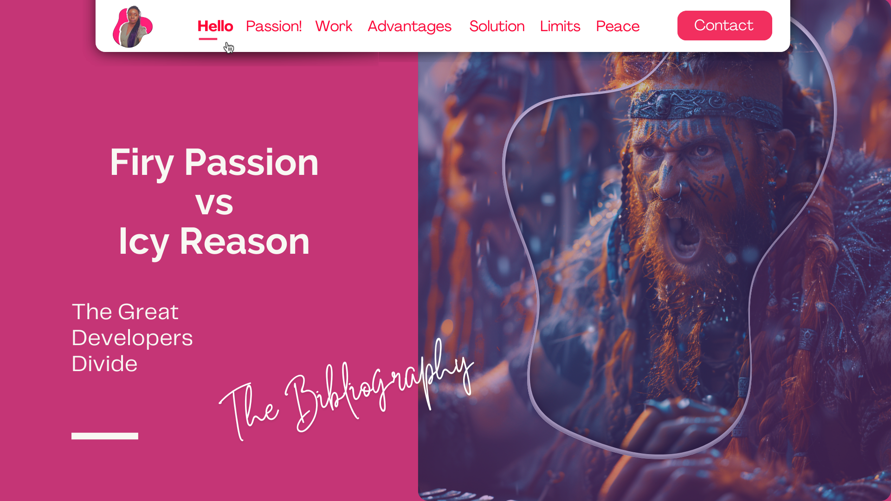

<!-- RESOURCES COVER -->
<div style="background-color: #F6F3FF; padding: 20px">
<p align="center" style="margin-top: -15px">
  <a href="https://github.com/HelviraG/resources.silent-figures">
    
  </a>
</p>

  <p align="center">
    All the images resources you've seen 😉!
    <br />
    <br />
    <a href="https://helvirag.github.io" style="padding: 6px 12px; color: black" onmouseover="this.style.color='purple'; this.style.fontWeight=''" onmouseleave="this.style.color='black'">🌐 Website</a>
    ·
    <a href="https://linkedin.com/helvira-dev" style="padding: 6px 12px; color: black" onmouseover="this.style.color='purple';fontSize=''" onmouseleave="this.style.color='black'; this.style.fontWeight='normal'; fontSize='12px'"> Linkedin</a>
    ·
    <a href="https://twitter.com/helvira_g" style="padding: 6px 12px; color: black" onmouseover="this.style.color='purple';" onmouseleave="this.style.color='black'">Twitter/X</a>
    ·
    <a href="https://www.buymeacoffee.com/helvira" style="padding: 6px 12px; color: black" onmouseover="this.style.color='purple';" onmouseleave="this.style.color='black'">🥤 Buy me a coffee</a>
  </p>

  <br />

<!-- READ MORE ASSETS -->
### 🎞️ Images Assets

<br/>

<!-- TABLE OF CONTENTS -->
#### Table of Contents


<ul style="list-style-type: none; margin-top: 40px;">
 <li style="margin-top: 20px">
    <details style="margin-top: 10px" open="open">
        <summary>
          <a href="#midjourney-images" style="color: black" onmouseover="this.style.fontWeight='700';this.style.color='#6A42AB';" onmouseout="this.style.fontWeight='';this.style.color='black';">👾 Midjourney Images</a>
        </summary>
      <!-- MIDJOURNEY IMAGES SECTION -->
         <ul style="list-style-type: none">
          <li><a href="https://github.com/HelviraG/conferences.resources/tree/main/firy_and_icy/sections/ImagesAssets.md#-planet-valhalla" style="color: black" onmouseover="this.style.fontWeight='700';this.style.color='#6A42AB';" onmouseout="this.style.fontWeight='';this.style.color='black';">📍 Planet Valhalla</a></li>
          <li style="margin-top: 2px"><a href="https://github.com/HelviraG/conferences.resources/tree/main/firy_and_icy/sections/ImagesAssets.md#-the-vikings" style="color: black" onmouseover="this.style.fontWeight='700';this.style.color='#6A42AB';" onmouseout="this.style.fontWeight='';this.style.color='black';">📍 The Vikings</a></li>
        </ul>
      </details>
    </li>
  </ul>
  <br />


### 👾 Midjourney Images

#### 📍 Planet Valhalla

  ```sh
    Script: A red gazy planet seen from space with written in bottom of the image in giant neon letters "Valhalla"
    # Job ID: 4ca5304d-321f-4381-919f-cb2db4fac351
    # seed --3176156740  
  ```
  <div style="max-width: 70%; margin: 0 auto">
    
  </div>

  ```sh
    Script: A red cloudy planet seen from space with stars photoshoot colored, with a futuristic bright neon sign in the bottom of the image that says in giant letter "Valhalla"
    # Job ID:  9193c783-a317-42bc-a45c-b8ff57b3739a
    # seed --843992840  
  ```
  <div style="max-width: 70%; margin: 0 auto">
    
  </div>

  ```sh
    Script: A fantasy map clearly Split in two parts, satellite photo
    # Job ID: b298e457-8fab-474f-8247-d9860d8a0b9c
    # seed --3227382508  
  ```
  <div style="max-width: 70%; margin: 0 auto">
    
  </div>

<br />

##### 📍 The Vikings

<details>
<summary>🔥 Flamesgaard</summary>

  ```sh
    Script: A gorgeous viking queen, a bright beautiful face war red painting, wearing an Amazon like armor, with vibrant red hair, sophisticated braids and jewelry, subtile profile angle, photo realistic, cinematic light, vibrant colors
    # Job ID: 25c65a99-ea53-4870-9747-9167d82861fb
    # seed --44516796  
  ```
  <div style="max-width: 70%; margin: 0 auto">
    
  </div>

  ```sh
    Script: A front row of vikings with red hair and braids, with red horns, screaming, ready to fight, typing on a keyboard, computer screen visible, looking fierce
    # Job ID: 68c9806f-ec2e-4e4c-aab5-856c781b01e5
    # seed --877073640  
  ```
  <div style="max-width: 70%; margin: 0 auto">
    
  </div>

  ```sh
    Script: A front row of vikings with red hair and braids, with red horns, screaming, ready to fight, typing on a keyboard, computer screen visible, looking fierce
    # Job ID: 120447b2-cf30-4a6a-89d9-113ee2ee5a87
    # seed --877073640  
  ```
  <div style="max-width: 70%; margin: 0 auto">
    
  </div>

  ```sh
    Script: A front row of vikings with red hair and braids, with red horns, screaming, ready to fight, typing on a keyboard, computer screen visible, looking fierce
    # Job ID: 24356437-de79-4457-98a9-43c470045e13
    # seed --877073640  
  ```
  <div style="max-width: 70%; margin: 0 auto">
    
  </div>

  ```sh
    Script: A front row of vikings with red hair and braids, with red horns, screaming, ready to fight, typing on a keyboard, computer screen visible, looking fierce
    # Job ID: b298e457-8fab-474f-8247-d9860d8a0b9c
    # seed --877073640  
  ```
  <div style="max-width: 70%; margin: 0 auto">
    
  </div>

  ```sh
    Script: A  front row of vikings with red hair and braids, with red horns, ready to fight, typing on a keyboard, looking fierce, with their computer screen in the foreground, photorealistic, cinematic light
    # Job ID: 564e7bcc-9fbc-460c-82c6-f4c095eb6f74
    # seed --1781832533  
  ```
  <div style="max-width: 70%; margin: 0 auto">
    
  </div>

  ```sh
    Script: A front row of vikings with red hair and braids, with red horns, screaming, ready to fight, typing on a keyboard, looking fierce, with their computer screen in the foreground, photorealistic, cinematic light
    # Job ID: b298e457-8fab-474f-8247-d9860d8a0b9c
    # seed --3227382508  
  ```
  <div style="max-width: 70%; margin: 0 auto">
    
  </div>

  ```sh
    Script: A front row of vikings with red hair and braids, with red horns, screaming, ready to fight, typing on a keyboard, looking fierce, with their computer screen in the foreground, photorealistic, cinematic light
    # Job ID: bae05ac8-ea8a-4e14-827e-1754a762555c
    # seed --2385038810  
  ```
  <div style="max-width: 70%; margin: 0 auto">
    
  </div>

  ```sh
    Script: A fantasy map clearly Split in two parts, satellite photo
    # Job ID: bd36b9ec-a0eb-4a4f-afeb-352324ac2de3
    # seed --2385038810  
  ```
  <div style="max-width: 70%; margin: 0 auto">
    
  </div>
</details>

<details>
<summary>🧊 Icegaard</summary>

  ```sh
    Script: A gorgeous viking queen, a bright beautiful face war painting, wearing an Amazon like armor, with blue hair, sophisticated braids and jewelry, subtile profile angle, photo realistic, cinematic light, vibrant colors
    # Job ID: 391d807d-bc64-4e74-8b3d-d77f43a82e60
    # seed --3616332674  
  ```
  <div style="max-width: 70%; margin: 0 auto">
    
  </div>

  <div style="max-width: 70%; margin: 0 auto">
    
  </div>

  ```sh
    Script: A front row of vikings with blue hair and braids, with blue horns, ready to fight, typing on a keyboard, looking fierce, with their computer screen in the foreground, photorealistic, cinematic light
    # Job ID: 38cfc790-7422-466b-81f9-4a307bae0d6f
    # seed --3094039146  
  ```
  <div style="max-width: 70%; margin: 0 auto">
    
  </div>

  ```sh
    Script: A front row of vikings with blue hair and braids, with blue helmet, ready to fight, typing on a keyboard, looking fierce, with their computer screen in the foreground, photorealistic, cinematic light
    # Job ID: 24163f9b-275d-4302-9e1c-d99e5358848d
    # seed --4132944021  
  ```
  <div style="max-width: 70%; margin: 0 auto">
    
  </div>

  ```sh
    Script: A front row of vikings with blue hair and braids, with blue helmet, ready to fight, typing on a keyboard, looking fierce, with their computer screen in the foreground, photorealistic, cinematic light
    # Job ID: b298e457-8fab-474f-8247-d9860d8a0b9c
    # seed --3088666809  
  ```
  <div style="max-width: 70%; margin: 0 auto">
    
  </div>

  ```sh
    Script: A front row of vikings with blue hair and braids, with blue horns, ready to fight, typing on a keyboard, looking fierce, with their computer screen in the foreground, photorealistic, cinematic light
    # Job ID: 211f8899-8d0c-4e9d-bbf2-37a29c73910b
    # seed --657639754  
  ```
  <div style="max-width: 70%; margin: 0 auto">
    
  </div>
</details>
</div>

