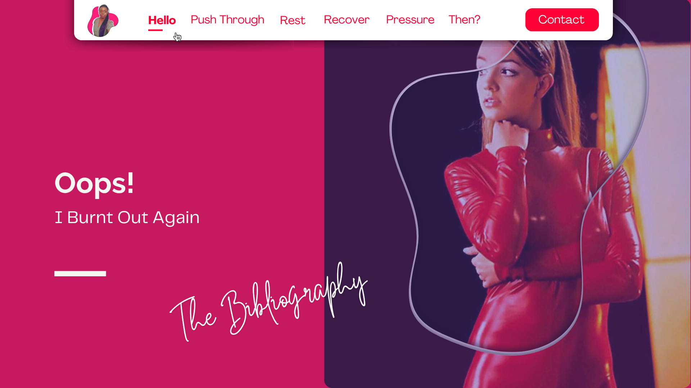

<!-- RESOURCES COVER -->

<div style="background-color: #F6F3FF; padding: 20px" class="markdown-body">
<p align="center" style="margin-top: -15px">
  <a href="https://github.com/HelviraG/conferences.resources/blob/main/%5BEN%5Dtech_skills_expiration/README.md">
    
  </a>
</p>

  <p align="center">
    All the resources you need to go further and beyond after the conference 😉!
    <br />
    <br />
    <a href="https://helvirag.github.io" style="padding: 6px 12px; color: black" onmouseover="this.style.color='purple'; this.style.fontWeight=''" onmouseleave="this.style.color='black'">🌐 Website</a>
    ·
    <a href="https://linkedin.com/helvira-dev" style="padding: 6px 12px; color: black" onmouseover="this.style.color='purple';fontSize=''" onmouseleave="this.style.color='black'; this.style.fontWeight='normal'; fontSize='12px'"> Linkedin</a>
    ·
    <a href="https://twitter.com/helvira_g" style="padding: 6px 12px; color: black" onmouseover="this.style.color='purple';" onmouseleave="this.style.color='black'">Twitter/X</a>
    ·
    <a href="https://bsky.app/profile/helvira.bsky.social" style="padding: 6px 12px; color: black" onmouseover="this.style.color='purple';" onmouseleave="this.style.color='black'">Bluesky</a>
    ·
    <a href="https://www.buymeacoffee.com/helvira" style="padding: 6px 12px; color: black" onmouseover="this.style.color='purple';" onmouseleave="this.style.color='black'">🥤 Buy me a coffee</a>
  </p>

  <br />

## Abstract:

```
I thought I had learned my lesson the first time. 
I saw the warning signs, ignored them, and told myself I could handle this. 
Spoiler alert: I couldn’t. Burnout hit me not once but twice, and each time, 
I found myself running on empty, questioning everything, 
and wondering if I’d ever enjoy coding again.

In this talk, I’ll take you through my journey of 
burnout — what led to it, how I ignored the red flags, 
and what finally made me hit “Force Quit.” 
We’ll explore why burnout is common in tech, 
why high performers are often the most vulnerable, 
and how we can break the cycle.

But this isn’t just a doom-and-gloom session — 
I’ll share the hard-earned lessons that helped me 
rise from the ashes (twice), rebuild my energy, 
and find a sustainable way to thrive in tech.

Expect storytimes, hard truths, and maybe even a laugh 
or two as we learn how to recognize burnout before 
it’s too late, recover when we crash, and—most 
importantly—stop history from repeating itself. 
Because if you’re anything like me, you don’t want 
to be singing Oops… I did it again.

```

</div>