<!-- SHORTLINKS -->
[susan-boyle]: https://people.com/all-about-susan-boyle-britain-got-talent-8409275
[dennis-ritchie]: https://www.wired.com/2011/10/dennis-ritchie/
[mark-zuckerberg]: https://fr.wikipedia.org/wiki/Mark_Zuckerberg

<!-- RESOURCES COVER -->
<div style="background-color: #F6F3FF; padding: 20px">
<p align="center" style="margin-top: -15px">
  <a href="https://github.com/HelviraG/resources.silent-figures">
    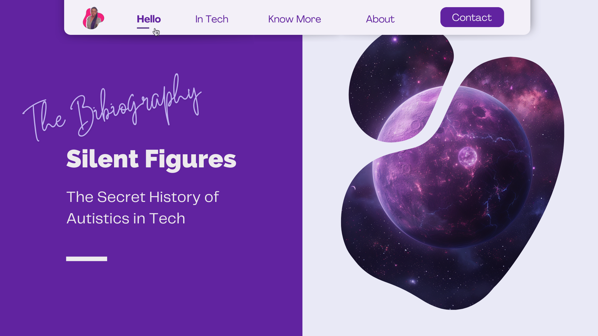
  </a>
</p>

  <p align="center">
    All the images resources you've seen 😉!
    <br />
    <br />
    <a href="https://helvirag.github.io" style="padding: 6px 12px; color: black" onmouseover="this.style.color='purple'; this.style.fontWeight=''" onmouseleave="this.style.color='black'">🌐 Website</a>
    ·
    <a href="https://linkedin.com/helvira-dev" style="padding: 6px 12px; color: black" onmouseover="this.style.color='purple';fontSize=''" onmouseleave="this.style.color='black'; this.style.fontWeight='normal'; fontSize='12px'"> Linkedin</a>
    ·
    <a href="https://twitter.com/helvira_g" style="padding: 6px 12px; color: black" onmouseover="this.style.color='purple';" onmouseleave="this.style.color='black'">Twitter/X</a>
    ·
    <a href="https://bsky.app/profile/helvira.bsky.social" style="padding: 6px 12px; color: black" onmouseover="this.style.color='purple';" onmouseleave="this.style.color='black'">Bluesky</a>
    ·
    <a href="https://www.buymeacoffee.com/helvira" style="padding: 6px 12px; color: black" onmouseover="this.style.color='purple';" onmouseleave="this.style.color='black'">🥤 Buy me a coffee</a>
  </p>

  <br />

  <!-- READ MORE ASSETS -->
  ### 🎞️ Images Assets

  <br />

  <!-- TABLE OF CONTENTS -->
  #### Table of Contents

  <ol style="list-style-type: none; margin-top: 40px;">
    <!-- IMAGES ASSETS SECTION -->
    <li style="margin-top: 20px">
      <!-- MIDJOURNEY IMAGES SECTION -->
      <details style="margin-top: 10px" open="open">
        <summary>
          <a href="#midjourney-images" style="color: black" onmouseover="this.style.fontWeight='700';this.style.color='#6A42AB';" onmouseout="this.style.fontWeight='';this.style.color='black';">👾 Midjourney Images</a>
        </summary>
        <ul style="list-style-type: none; margin-top: 6px">
          <li><a href="#planet-zepharia" style="color: black" onmouseover="this.style.fontWeight='700';this.style.color='#6A42AB';" onmouseout="this.style.fontWeight='';this.style.color='black';">📍 Planet Zepharia</a></li>
          <li style="margin-top: 2px"><a href="#the-zepharians" style="color: black" onmouseover="this.style.fontWeight='700';this.style.color='#6A42AB';" onmouseout="this.style.fontWeight='';this.style.color='black';">📍 The Zepharians</a></li>
          <li style="margin-top: 2px"><a href="#the-oss-2024-jcon-spaceship" style="color: black" onmouseover="this.style.fontWeight='700';this.style.color='#6A42AB';" onmouseout="this.style.fontWeight='';this.style.color='black';">📍 JCON Spaceship</a></li>
          <li style="margin-top: 2px"><a href="#scuba-diving" style="color: black" onmouseover="this.style.fontWeight='700';this.style.color='#6A42AB';" onmouseout="this.style.fontWeight='';this.style.color='black';">📍 Scuba Diving</a></li>
          <li style="margin-top: 2px"><a href="#story-of-a-book-and-a-forest" style="color: black" onmouseover="this.style.fontWeight='700';this.style.color='#6A42AB';" onmouseout="this.style.fontWeight='';this.style.color='black';">📍 A Book and a Forest</a></li>
          <li style="margin-top: 2px"><a href="#autistic-people-from-midjourneys-perspective" style="color: black" onmouseover="this.style.fontWeight='700';this.style.color='#6A42AB';" onmouseout="this.style.fontWeight='';this.style.color='black';">📍 Autistic People</a></li>
        </ul>
        </details>
    </li>
    <li style="margin-top: 20px">
      <!-- EXTERNAL IMAGES SECTION -->
        <details style="margin-top: 10px" open="open">
        <summary>
          <a href="#external-images" style="color: black" onmouseover="this.style.fontWeight='700';this.style.color='#6A42AB';" onmouseout="this.style.fontWeight='';this.style.color='black';">📎 External Images</a>
        </summary>
        <ul style="list-style-type: none; margin-top: 6px">
          <li><a href="#susan-boyle" style="color: black" onmouseover="this.style.fontWeight='700';this.style.color='#6A42AB';" onmouseout="this.style.fontWeight='';this.style.color='black';">📍 Susan Boyle</a></li>
          <li style="margin-top: 2px"><a href="#dennis-ritchie" style="color: black" onmouseover="this.style.fontWeight='700';this.style.color='#6A42AB';" onmouseout="this.style.fontWeight='';this.style.color='black';">📍 Denis Ritchie</a></li>
          <li style="margin-top: 2px"><a href="#mark-zuckerberg" style="color: black" onmouseover="this.style.fontWeight='700';this.style.color='#6A42AB';" onmouseout="this.style.fontWeight='';this.style.color='black';">📍 Mark Zuckerberg</a></li>
          <li style="margin-top: 2px"><a href="#captain-spoke" style="color: black" onmouseover="this.style.fontWeight='700';this.style.color='#6A42AB';" onmouseout="this.style.fontWeight='';this.style.color='black';">📍 Captain Spoke</a></li>
        </ul>
        </details>
      </ul>
      </details>
    </li>
  </ol>


  <!-- IMAGES ASSETS -->
  ### 🎞️ Images Assets

  <br />

  ##### Planet Zepharia

  ```sh
    Script: A purple planet seen from space realistic photoshoot colored
    # Job ID: 8d685b0e-0756-4678-ac68-a76419429c4b
    # seed --2291172810  
  ```
  <div style="max-width: 70%; margin: 0 auto">
    
  </div>
  <br />

   ```sh
    Script: A purple cloudy planet seen from space photoshoot colored, with a futuristic bright neon sign in the bottom of the image that says in giant letter "Zepharia"
    # Job ID: 96716548-3da2-4852-9c67-b1e110cb9d57
    # seed --610071182  
  ```
  <div style="max-width: 70%; margin: 0 auto">
    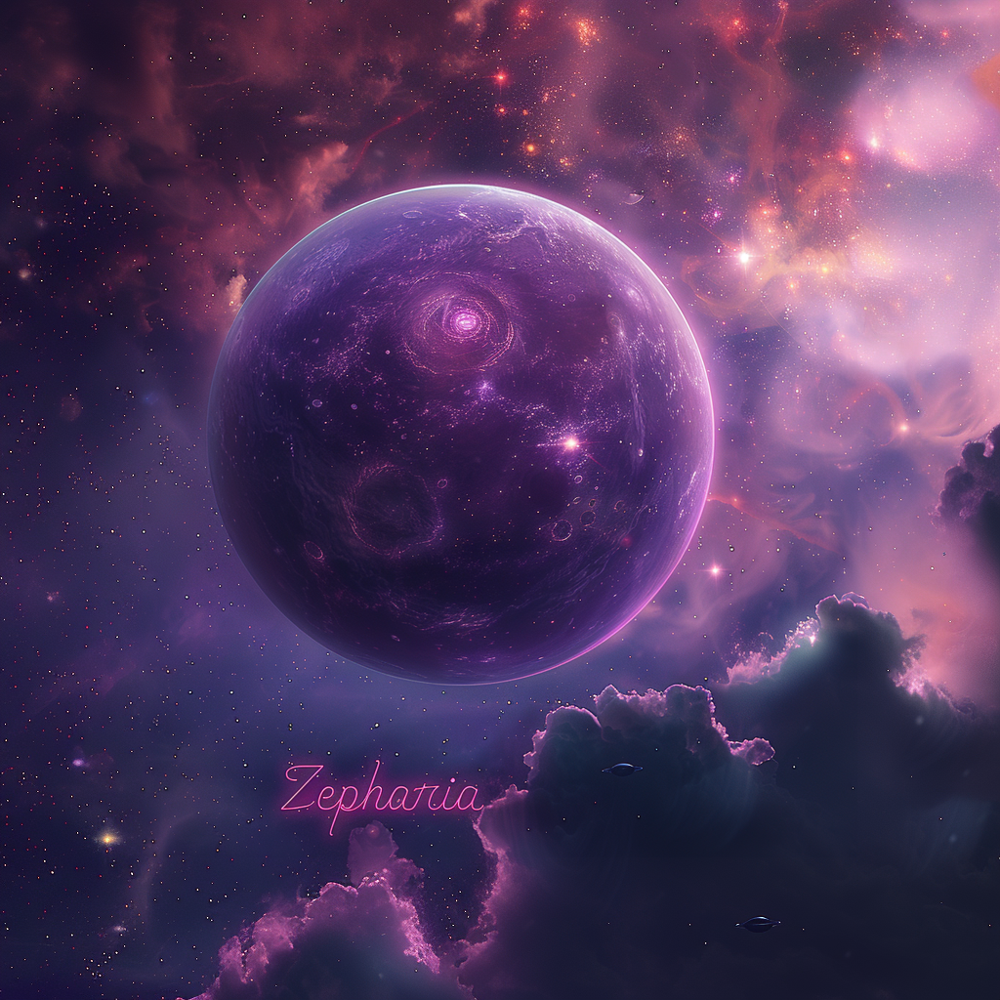
  </div>
  <br />

 ```sh
    Script: A subterranean city carved beneath the earth’s surface, featuring sprawling tunnels and illuminated chambers. Bioluminescent plants and advanced artificial lighting create an otherworldly ambiance, while advanced technology sustains life in this hidden metropolis
    # Job ID: 1811c79c-ad25-465c-9860-011e05fa3d9e
    # seed --1866609298  
  ```
  <div style="max-width: 70%; margin: 0 auto">
    
  </div>
  <br />

   ```sh
    Script: An eco-friendly utopian cityscape, where renewable energy sources are seamlessly integrated into the urban infrastructure. Purple roofs, solar panels, and wind turbines adorn the futuristic buildings, while electric vehicles and smart transportation systems create a sustainable urban environment
    # Job ID: 8d685b0e-0756-4678-ac68-a76419429c4b
    # seed --2291172810  
  ```
  <div style="max-width: 70%; margin: 0 auto">
    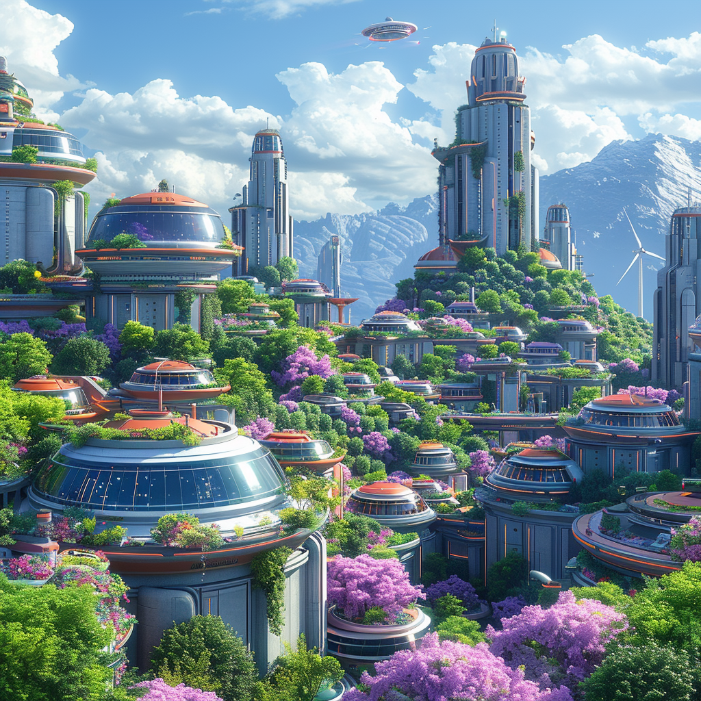
  </div>
  <br />

   ```sh
    Script: A desert city of the future made of purple sand, where advanced terraforming technologies have transformed arid landscapes into lush oasis-like environments. Glass domes protect the city from harsh weather conditions, while advanced water harvesting systems sustain the population
    # Job ID: 086fb8c3-86e2-44e1-bc0b-35bc0944992a
    # seed --2825323477  
  ```
  <div style="max-width: 70%; margin: 0 auto">
    
  </div>
  <br />

   ```sh
    Script: An intricate digital painting depicting a futuristic city nestled in a lush, bio-engineered forest. The city seamlessly integrates with nature, featuring vertical gardens, cascading waterfalls, and floating walkways, creating a harmonious coexistence between technology and the environment
    # Job ID: 59b608f3-b062-4745-8df2-0d0e765bcd8c
    # seed --1281256309  
  ```
  <div style="max-width: 70%; margin: 0 auto">
    
  </div>
  <br />

   ```sh
    Script: A megastructure city that spans across multiple levels, with skybridges connecting towering structures and vast vertical gardens creating a sense of harmony between nature and technological advancement. Flying vehicles navigate through layers of futuristic architecture.
    # Job ID: e8cb8bbe-7db1-437d-a8fe-6feb06ef15c7
    # seed --471081715  
  ```
  <div style="max-width: 70%; margin: 0 auto">
    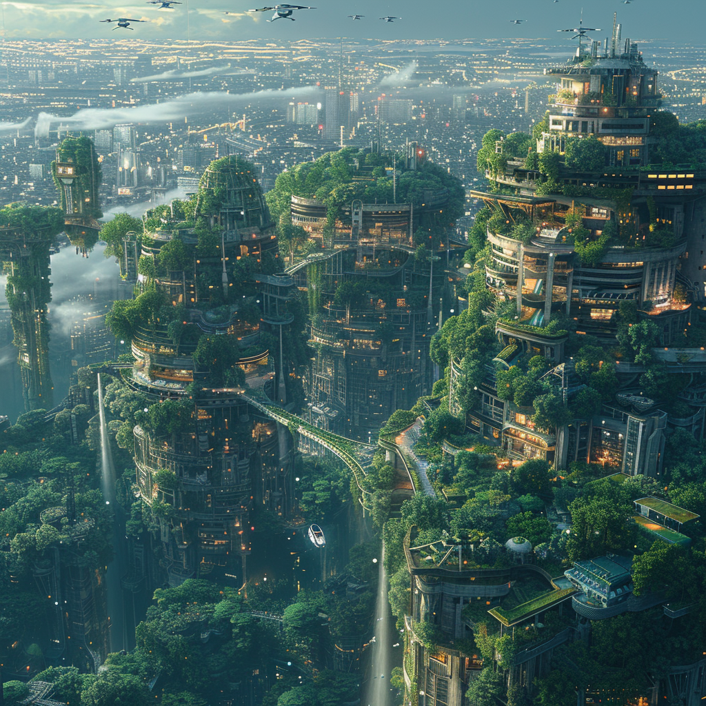
  </div>
  <br />

   ```sh
    Script: A retro-futuristic city inspired by 1960s science fiction, with sleek, curvaceous buildings, flying saucer-shaped vehicles, and robotic companions assisting residents in their daily lives. The city exudes a sense of nostalgia while embracing a vision of the future from the past.
    # Job ID: fcfd861a-b683-4c21-9d64-8cd59a29e67f
    # seed --3761570088  
  ```
  <div style="max-width: 70%; margin: 0 auto">
    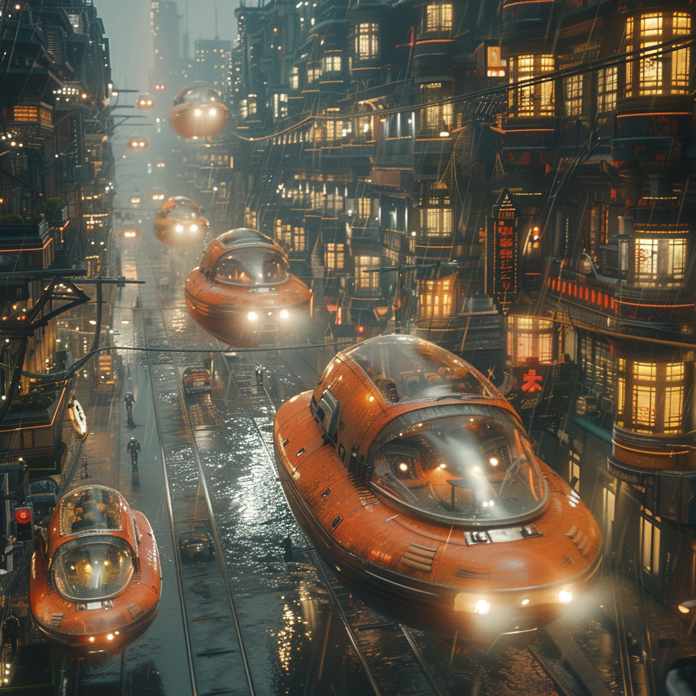
  </div>
  <br />

   ```sh
    Script: An eco-friendly utopian cityscape, where renewable energy sources are seamlessly integrated into the urban infrastructure. Purple roofs, solar panels, and wind turbines adorn the futuristic buildings, while electric vehicles and smart transportation systems create a sustainable urban environment
    # Job ID: 1d7f5a72-fde3-415b-a3da-32b230cee805
    # seed --1191827163  
  ```
  <div style="max-width: 70%; margin: 0 auto">
    
  </div>
  <br />

   ```sh
    Script: An eco-friendly utopian cityscape, where renewable energy sources are seamlessly integrated into the urban infrastructure. Purple roofs, solar panels, and wind turbines adorn the futuristic buildings, while electric vehicles and smart transportation systems create a sustainable urban environment
    # Job ID: 26f4eabf-e808-468e-a9a9-7b6235a741b4
    # seed --1191827163  
  ```
  <div style="max-width: 70%; margin: 0 auto">
    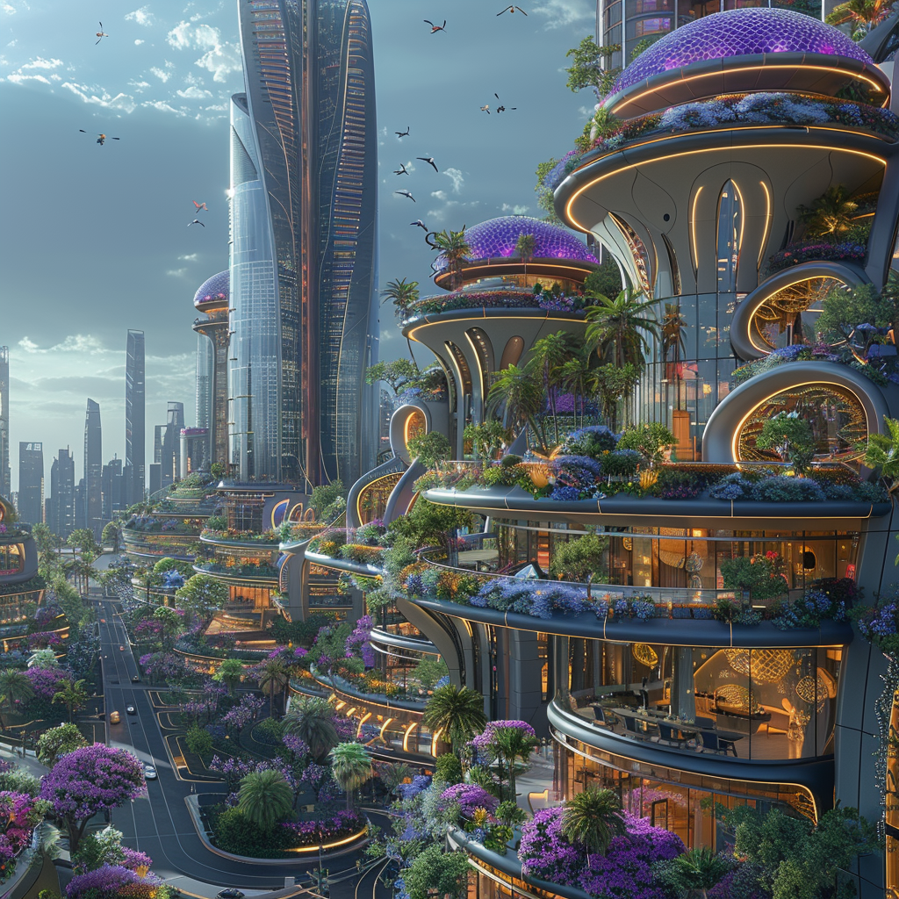
  </div>
  <br />
  <br />


  ##### The Zepharians

  ```sh
    Purple skin man and woman on uniform from a planet where the population descent from the XMen character: Mystic with long white hair and white eyes portrayed realistic photoshoot colored vibrant filters
    # Job ID: 3143f0cc-0380-4903-b277-580e458ec3de
    # seed --49266347  
  ```
  <div style="max-width: 70%; margin: 0 auto">
    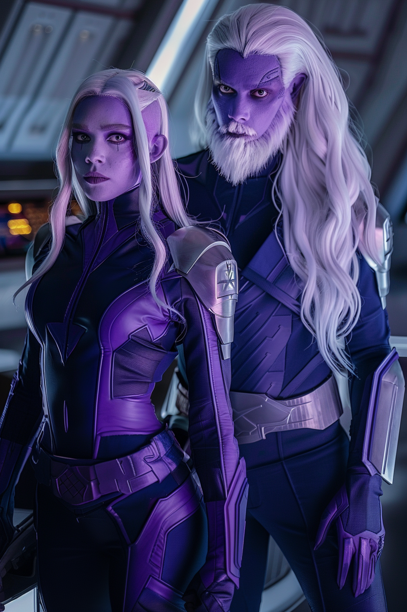
  </div>
  <br />

  ```sh
    A front row of people looking introspective, typing on a keyboard
    # Job ID: f0394bf0-3f21-4594-9f11-bbf850c646aa
    # seed --1345423692  
  ```
  <div style="max-width: 70%; margin: 0 auto">
    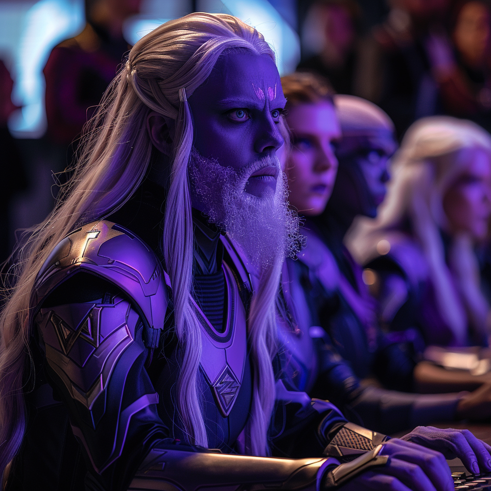
  </div>
  <br />
  
  ```sh
    A front row of people looking introspective, typing on a keyboard visible as the computer on the scene
    # Job ID: 8d685b0e-0756-4678-ac68-a76419429c4b
    # seed --2291172810  
  ```
  <div style="max-width: 70%; margin: 0 auto">
    
  </div>
  <br />


  ```sh
    Same purple-skinned beautiful people wearing a green uniform, with vikings braids hairstyles
    # Job ID: 77b50eb7-363d-4325-aa7b-34a564aaacf0
    # seed --2633838722  
  ```
  <div style="max-width: 70%; margin: 0 auto">
    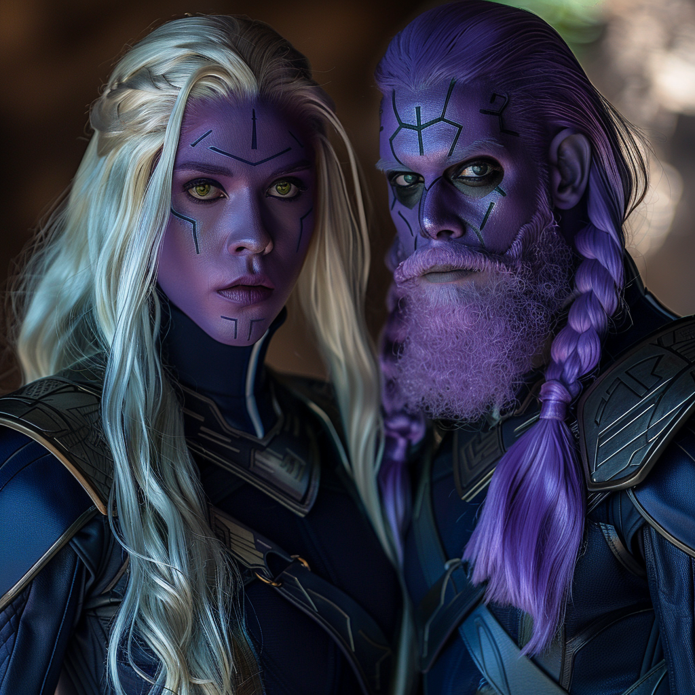
  </div>
  <br />


  ```sh
    Same purple-skinned beautiful stunning people wearing a light green uniform, with vikings braids hairstyles
    # Job ID: 77b50eb7-363d-4325-aa7b-34a564aaacf0
    # seed --2633838722  
  ```
  <div style="max-width: 70%; margin: 0 auto">
    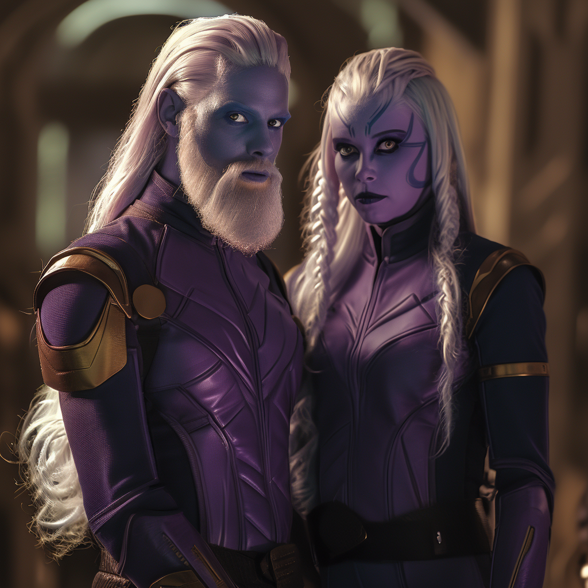
  </div>
  <br />


  ```sh
    A front row of people looking introspective, typing on a keyboard
    # Job ID: 77b50eb7-363d-4325-aa7b-34a564aaacf0
    # seed --2633838722  
  ```
  <div style="max-width: 70%; margin: 0 auto">
    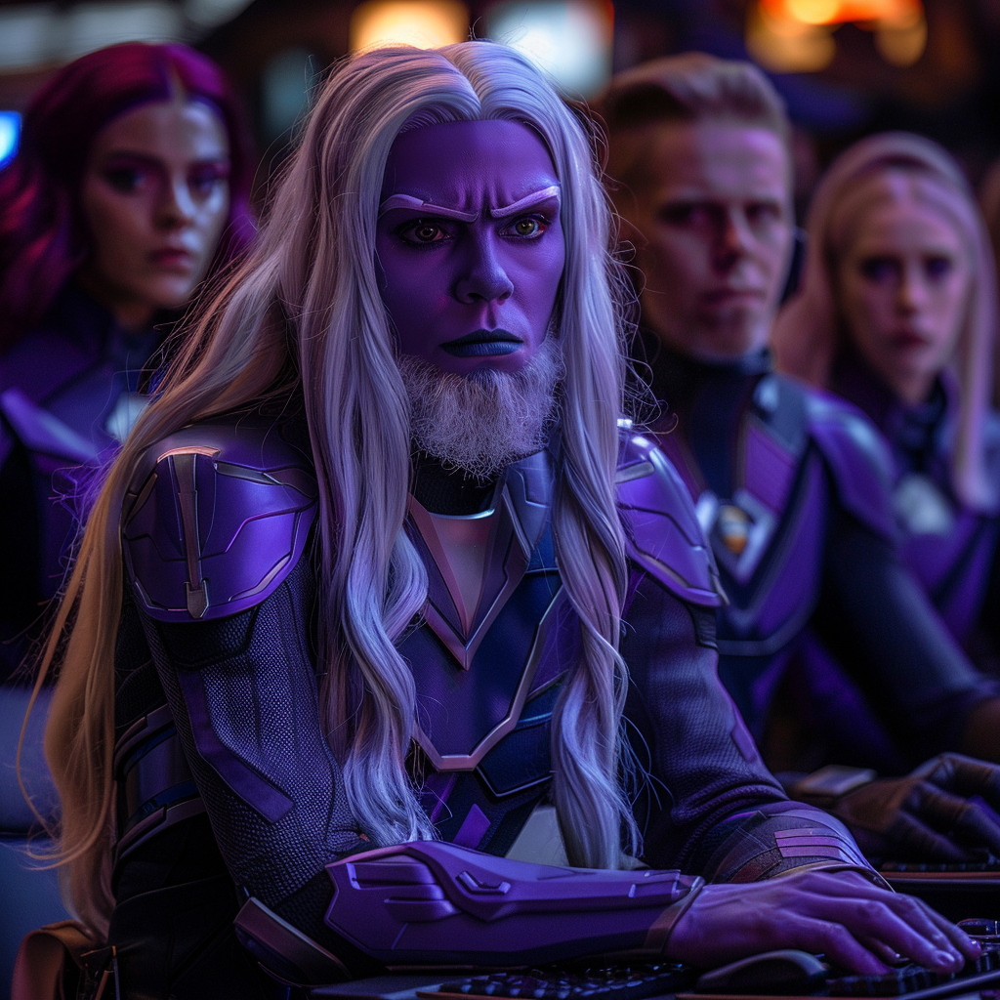
  </div>
  <br />

  ```sh
    A man standing side by side next to a woman with white purplish long hair
    # Job ID: af121745-d082-40de-a9ed-6aa13db8895b
    # seed --169193846  
  ```
  <div style="max-width: 70%; margin: 0 auto">
    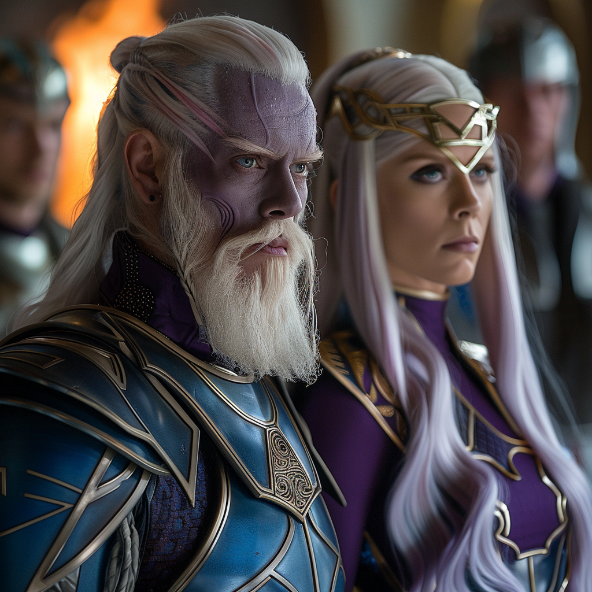
  </div>
  <br />

  ##### The OSS JCON 2024 spaceship

  ```sh
    A bioluminescent spaceship with it's name appearing on the side of the spaceshiop saying "JCON 2024", on orbital mode around a purple planet visible in the background
    # Job ID: 3b3abe10-a8a6-460a-a1d7-83440d9e090c
    # seed --4293206203  
  ```
  <div style="max-width: 70%; margin: 0 auto">
    
  </div>
  <br />

  ##### Scuba diving

  ```sh
    Script: A man scuba diving in a ocean where fishes 
    and corals are computers, mouses and keyboards
    # Job ID: 7c095a5a-490c-44b4-90b1-c8cbf8765ada
    # seed --107183715  
  ```
  <div style="max-width: 70%; margin: 0 auto">
    
  </div>
  <br />

  ```sh
    Script: A man scuba diving in a ocean where fishes and corals are computers, mouses and keyboards vibrant colors
    # Job ID: 2fa7d6a3-9db9-4469-a163-53df65174aba
    # seed --2894571838  
  ```
  <div style="max-width: 70%; margin: 0 auto">
    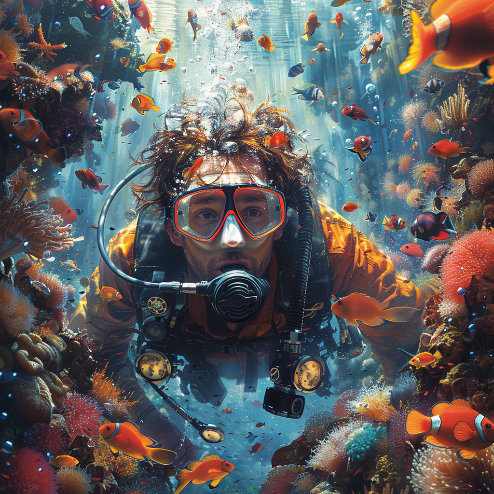
  </div>
  <br />

  ##### Story of a Book and a Forest

  ```sh
    Script: A closeup Book wide open on a 3d scenery of a young girl, with short dark hair, holding a lantern in the middle of a forest, profile angle, vibrant pink purple color palette
    # Job ID: cdc54cc5-5f7d-4068-abdb-2620f1fd27eb
    # seed --2014892140  
  ```
  <div style="max-width: 70%; margin: 0 auto">
    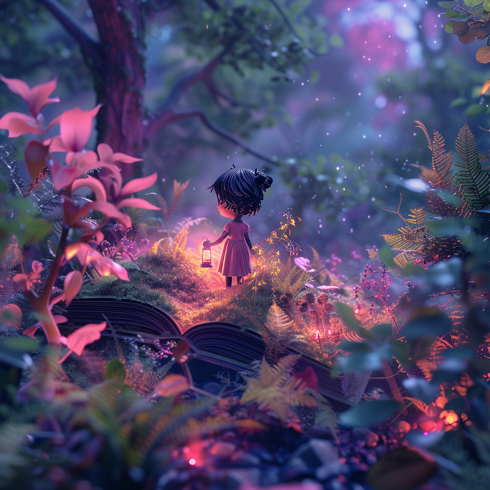
  </div>
  <br />

  ```sh
    Script: A a closeup Book wide open on a 3d scenery of a young girl, with short dark hair, holding a lantern in the middle of a forest, profile angle, vibrant pink purple color palette -variant_version 
    # Job ID:  f3c392df-0d48-4c94-b94f-2b5994356864
    # seed --2014892140  
  ```
  <div style="max-width: 70%; margin: 0 auto">
    
  </div>
  <br />

  ##### Autistic People from Midjourney's perspective

  ```sh
    Someone on earth who is on the autism spectrum disorder
    # Job ID: c29b1faa-6334-4b9d-9f60-aa63134cbbe8
    # seed --2321557962  
  ```
  <div style="max-width: 70%; margin: 0 auto">
    
  </div>
  <br />

  
  ```sh
    A closeup photoshoot of an autistic human being, photorealistic
    # Job ID: dc983d86-c831-4d89-bf7e-af00957e419d
    # seed --3875104204  
  ```
  <div style="max-width: 70%; margin: 0 auto">
    
  </div>
  <br />
    
  ```sh
    A closeup photoshoot of an autistic person, photorealistic, vibrant colors
    # Job ID: ff5ef985-3c97-4114-bb4a-8c7e92729716
    # seed -- 4198220682  
  ```
  <div style="max-width: 70%; margin: 0 auto">
    
  </div>
  <br />
    
  ```sh
    A photoshoot commercial with a lineup of giggling autistic people, eclectic colorful casual clothings posing in front of a busy city street, day light, wes anderson color palette
    # Job ID: a1a413f2-8559-401d-8528-9bc4af91f73a
    # seed --3050457661  
  ```
  <div style="max-width: 70%; margin: 0 auto">
    
  </div>
  <br />
      
  ```sh
    A photoshoot commercial with a lineup of giggling::2 autistic::2 people from different continents and ethnicities, colorful fashion outfits posing in front of a busy city street, day light, wes anderson color palette
    # Job ID: d66a850b-8e05-4caf-b0c9-0f8da64c640
    # seed --3821505814  
  ```
  <div style="max-width: 70%; margin: 0 auto">
    
  </div>
  <br />
  <br />


  #### External Images
<br />

  ##### Susan Boyle

  ```sh
  Desc: Susan Boyle attends the world premiere for 'England is mine' 
  during the 71st Edinburgh International Film Festival on July 2, 
  2017 in Edinburgh, Scotland. 

  Credits: ROBERTO RICCIUTI/GETTY
  ```
  <p align="center"><span style="font-size: 12px;">Click on the image to view the original source</span></p>
  
  
<br />

  ##### Dennis Ritchie

  ```sh
  Desc: Dennis Ritchie poses after receiving the 2011 Japan Prize 
  at Bell Labs headquarters in Murray Hill, New Jersey, 
  on Tuesday, May 19, 2011. Ritchie was awarded the 2011 Japan Prize 
  for his role in co-developing the UNIX operating system in 1969.

  Credits: Victoria Will/AP Images for Japan Prize Foundation 
  ```
  <p align="center"><span style="font-size: 12px;">Click on the image to view the original source</span></p>

  

<br />

  ##### Mark Zuckerberg

  ```sh
  Desc: Facebook's Developer Conference on April 30, 2019.

  Credits: Unknown
  ```
  <p align="center"><span style="font-size: 12px;">Click on the image to view the original source</span></p>

   [mark-zuckerberg]

<br />

  ##### Captain Spoke

  ```sh
  Desc: Actor Leonard Nimoy playing Spock, in the "Star Trek"
  TV show (1966-1969).

  Credits: PARAMOUNT TELEVISION / KOBAL / AFP
  ```

  

<br />

  ##### Tina Belcher (Bob's Burger)

  ```sh
  Desc: Tina Gif Danse
  ```

  


</div>