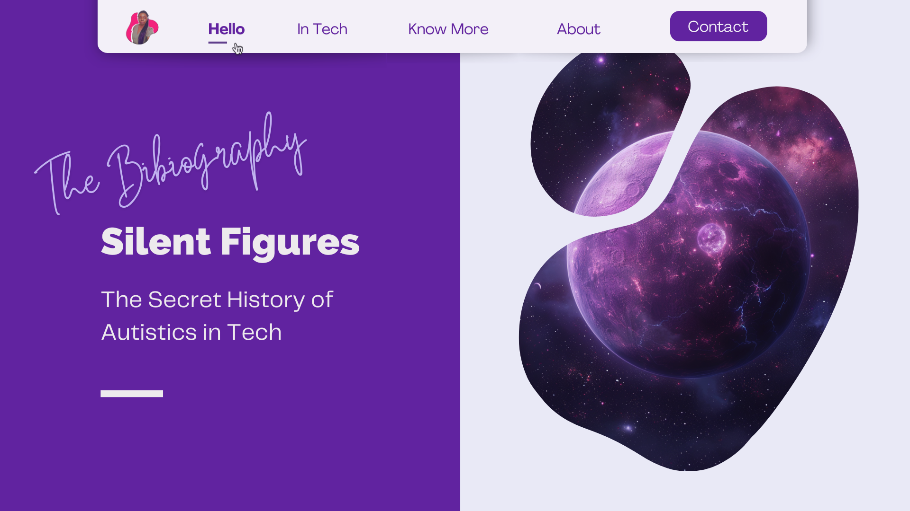

<!-- SHORTLINKS -->
[live-extreme]: https://journals.sagepub.com/doi/10.1177/13623613231198916
[interact-judgement]: https://www.nature.com/articles/srep40700
[competitve-advantage]: https://hbr.org/2017/05/neurodiversity-as-a-competitive-advantage
[futur-perspective]: https://journals.sagepub.com/doi/abs/10.1177/1044207320919945
[autism-work-force]: https://www.cambridge.org/core/journals/journal-of-management-and-organization/article/abs/autism-in-the-workforce-a-case-study/D9B97F5F74094A3C1BB9FADA601D7467
[redefine-talents]: https://scholarspace.manoa.hawaii.edu/items/87e181b6-54a6-4a10-b1ac-f606abc4c87f
[what-works]: https://www.sciencedirect.com/science/article/abs/pii/S1750946719300145
[autistic-myth]: https://www.gamedeveloper.com/business/dispelling-some-myths-about-the-autistic-wunderkind-programmer#close-modal
[autism-workplace]: https://www.templeton-recruitment.com/tech-news/autism-in-the-workplace-the-benefits-of-autistic-talent-in-tech

<!-- RESOURCES COVER -->

  

  

    All you can read 🧐!
     
     
    <a href="https://helvirag.github.io" style="padding: 6px 12px; color: black" onmouseover="this.style.color='purple'; this.style.fontWeight=''" onmouseleave="this.style.color='black'">🌐 Website</a>
    ·
    <a href="https://linkedin.com/helvira-dev" style="padding: 6px 12px; color: black" onmouseover="this.style.color='purple';fontSize=''" onmouseleave="this.style.color='black'; this.style.fontWeight='normal'; fontSize='12px'"> Linkedin</a>
    ·
    <a href="https://twitter.com/helvira_g" style="padding: 6px 12px; color: black" onmouseover="this.style.color='purple';" onmouseleave="this.style.color='black'">Twitter/X</a>
    ·
    <a href="https://www.buymeacoffee.com/helvira" style="padding: 6px 12px; color: black" onmouseover="this.style.color='purple';" onmouseleave="this.style.color='black'">🥤 Buy me a coffee</a>
  

   

  <!-- PAPER ASSETS -->
  ### 🗞️ Paper Assets

   
    
  <!-- TABLE OF CONTENTS -->
  #### Table of Contents

  <ol style="list-style-type: none; margin-top: 40px;">
    <li style="margin-top: 8px">
    <a href="https://github.com/HelviraG/conferences.resources/blob/main/%5BEN%5Dsilent_figures/sections/PaperAssets.md#-i-live-in-extremes-a-qualitative-investigation-of-autistic-adults-experiences-of-inertial-rest-and-motion" style="color: black" onmouseover="this.style.fontWeight='700';this.style.color='#6A42AB';" onmouseout="this.style.fontWeight='';this.style.color='black';">🧷 ‘I live in extremes’: A qualitative investigation of Autistic adults’ experiences of inertial rest and motion</a>
    </li>
    <li style="margin-top: 10px">
    <a href="https://github.com/HelviraG/conferences.resources/blob/main/%5BEN%5Dsilent_figures/sections/PaperAssets.md#-neurotypical-peers-are-less-willing-to-interact-with-those-with-autism-based-on-thin-slice-judgments" style="color: black" onmouseover="this.style.fontWeight='700';this.style.color='#6A42AB';" onmouseout="this.style.fontWeight='';this.style.color='black';">🧷 Neurotypical Peers are Less Willing to Interact with Those with Autism based on Thin Slice Judgments</a>
    </li>
    <li style="margin-top: 10px">
    <a href="https://github.com/HelviraG/conferences.resources/blob/main/%5BEN%5Dsilent_figures/sections/PaperAssets.md#-neurodiversity-as-a-competitive-advantage---why-you-should-embrace-it-in-your-workforce" style="color: black" onmouseover="this.style.fontWeight='700';this.style.color='#6A42AB';" onmouseout="this.style.fontWeight='';this.style.color='black';">🧷 Neurodiversity as a Competitive Advantage - Why you should embrace it in your workforce</a>
    </li>
    <li style="margin-top: 10px">
    <a href="https://github.com/HelviraG/conferences.resources/blob/main/%5BEN%5Dsilent_figures/sections/PaperAssets.md#-employees-with-autism-spectrum-disorders-in-the-digitized-work-environment-perspectives-for-the-future" style="color: black" onmouseover="this.style.fontWeight='700';this.style.color='#6A42AB';" onmouseout="this.style.fontWeight='';this.style.color='black';">🧷 Employees With Autism Spectrum Disorders in the Digitized Work Environment: Perspectives for the Future</a>
    </li>
    <li style="margin-top: 10px">
    <a href="https://github.com/HelviraG/conferences.resources/blob/main/%5BEN%5Dsilent_figures/sections/PaperAssets.md#-autism-in-the-workforce-a-case-study-" style="color: black" onmouseover="this.style.fontWeight='700';this.style.color='#6A42AB';" onmouseout="this.style.fontWeight='';this.style.color='black';">🧷 Autism in the workforce: A case study</a>
    </li>
    <li style="margin-top: 10px">
    <a href="https://github.com/HelviraG/conferences.resources/blob/main/%5BEN%5Dsilent_figures/sections/PaperAssets.md#-its-not-just-about-attention-to-details-redefining-the-talents-autistic-software-developers-bring-to-software-development" style="color: black" onmouseover="this.style.fontWeight='700';this.style.color='#6A42AB';" onmouseout="this.style.fontWeight='';this.style.color='black';">🧷 It’s Not Just About Attention to Details: Redefining the Talents Autistic Software Developers Bring to Software Development</a>
    </li>
    <li style="margin-top: 10px">
    <a href="https://github.com/HelviraG/conferences.resources/blob/main/%5BEN%5Dsilent_figures/sections/PaperAssets.md#-autism-and-employment-what-works" style="color: black" onmouseover="this.style.fontWeight='700';this.style.color='#6A42AB';" onmouseout="this.style.fontWeight='';this.style.color='black';">🧷 Autism and employment: What works</a>
    </li>
    <li style="margin-top: 10px">
    <a href="https://github.com/HelviraG/conferences.resources/blob/main/%5BEN%5Dsilent_figures/sections/PaperAssets.md#-dispelling-some-myths-about-the-autistic-wunderkind-programmer" style="color: black" onmouseover="this.style.fontWeight='700';this.style.color='#6A42AB';" onmouseout="this.style.fontWeight='';this.style.color='black';">🧷 Dispelling some myths about the autistic wunderkind programmer</a>
    </li>
    <li style="margin-top: 10px">
    <a href="https://github.com/HelviraG/conferences.resources/blob/main/%5BEN%5Dsilent_figures/sections/PaperAssets.md#-understanding-the-challenges-faced-by-neurodiverse-software-engineering-employees-towards-a-more-inclusive-and-productive-technical-workforce" style="color: black" onmouseover="this.style.fontWeight='700';this.style.color='#6A42AB';" onmouseout="this.style.fontWeight='';this.style.color='black';">🧷 Understanding the Challenges Faced by Neurodiverse Software Engineering Employees: Towards a More Inclusive and Productive Technical Workforce</a>
    </li>
    <li style="margin-top: 10px">
    <a href="https://github.com/HelviraG/conferences.resources/blob/main/%5BEN%5Dsilent_figures/sections/PaperAssets.md#-autism-in-the-workplace-the-benefits-of-autistic-talent-in-tech" style="color: black" onmouseover="this.style.fontWeight='700';this.style.color='#6A42AB';" onmouseout="this.style.fontWeight='';this.style.color='black';">🧷 Autism in the Workplace: The Benefits of Autistic Talent in Tech</a>
    </li>
</ol>

   
  
  ###### 📰 ‘I live in extremes’: A qualitative investigation of Autistic adults’ experiences of inertial rest and motion
  
  <table>
    <tbody>
      <tr align="left">
        <td style="border: none">
Authors: Hannah Rapaport, Hayley Clapham, Jon Adams, Wenn Lawson, Kaska Porayska-Pomsta, Elizabeth Pallicano
</td>
        <td width="20%" style="border: none; vertical-align: top">
          <a href="[live-extreme]" 
            style="color: white; background-color: #ff4757; border: 1px solid #ff4757; padding: 6px; border-radius: 10px" 
            onmouseover="this.style.fontWeight='500';this.style.border='1px solid #ffa502';this.style.color='white';this.style.backgroundColor='#ffa502';" 
            onmouseout="this.style.fontWeight='';this.style.color='white';this.style.backgroundColor='#ff4757';this.style.borderColor='#ff4757'">
            Read 👀
          </a>
        </td>
      </tr>
    </tbody>
  </table>
  <h6>Abstract:</h6>
  

  ‘Autistic inertia’ is part of the Autistic community’s everyday lexicon, yet the condition has received scant attention in the academic literature. The little attention it has received has focused on the disabling impact of ‘inertial rest’ (difficulty initiating tasks), with minimal exploration of the potential benefits of inertial motion (difficulty stopping tasks). Here, we sought to investigate Autistic people’s phenomenological experiences of inertial rest and motion and to identify factors that might moderate Autistic inertia. Autistic and non-Autistic researchers conducted semi-structured interviews with 24 Autistic adults. We analysed the data using reflexive thematic analysis, adopting an inductive approach within an essentialist framework. Interviewees spoke in-depth of their inertial ‘difficulties moving from one state to another’ and described how these challenges pervade ‘every single day’. While inertia was described as ‘the single most disabling part of being Autistic’, interviewees also described ways to respond to inertia, including taking pleasure in states of flow, whereby they could become completely absorbed in a task. While inertial difficulties are pervasive, our findings reveal the extreme nature of these task-switching difficulties for Autistic people. Our findings also contribute to a more holistic characterisation of inertia as both a disabling and enabling condition.
  

  <blockquote style="border: none; border-radius: 6px; padding: 10px">
    

      
Figure 1. Participants’ perspectives on their starting and stopping difficulties on everyday tasks: themes and subthemes. 

      
    

  </blockquote>
  

  ###### 📰 Neurotypical Peers are Less Willing to Interact with Those with Autism based on Thin Slice Judgments 

  <table>
    <tbody>
      <tr align="left">
        <td style="border: none">
Authors: Noah J. Sasson, Daniel J. Faso, Jack Nugent, Sarah Lovell, Daniel P. Kennedy & Ruth B. Grossman
</td>
        <td width="20%" style="border: none; vertical-align: top">
          <a href="[interact-judgement]" style="color: white; background-color: #ff4757; border: 1px solid #ff4757; padding: 6px; border-radius: 10px" 
            onmouseover="this.style.fontWeight='500';this.style.border='1px solid #ffa502';this.style.color='white';this.style.backgroundColor='#ffa502';" 
            onmouseout="this.style.fontWeight='';this.style.color='white';this.style.backgroundColor='#ff4757';this.style.borderColor='#ff4757'">
            Read 👀
          </a>
        </td>
      </tr>
    </tbody>
  </table>
  <h6>Abstract:</h6>
  

  Individuals with autism spectrum disorder (ASD), including those who otherwise require less support, face severe difficulties in everyday social interactions. Research in this area has primarily focused on identifying the cognitive and neurological differences that contribute to these social impairments, but social interaction by definition involves more than one person and social difficulties may arise not just from people with ASD themselves, but also from the perceptions, judgments, and social decisions made by those around them. Here, across three studies, we find that first impressions of individuals with ASD made from thin slices of real-world social behavior by typically-developing observers are not only far less favorable across a range of trait judgments compared to controls, but also are associated with reduced intentions to pursue social interaction. These patterns are remarkably robust, occur within seconds, do not change with increased exposure, and persist across both child and adult age groups. However, these biases disappear when impressions are based on conversational content lacking audio-visual cues, suggesting that style, not substance, drives negative impressions of ASD. Collectively, these findings advocate for a broader perspective of social difficulties in ASD that considers both the individual’s impairments and the biases of potential social partners.  

   <blockquote style="border: none; border-radius: 6px; padding: 10px">
    

      
Figure 1. Group effects on each modality. Groups only did significantly differ on the transcript of Speech Content. 

      
    

  </blockquote>  
  <blockquote style="border: none; border-radius: 6px; padding: 10px">
    

      
Figure 2. Group effects on each item. ASD group is rated significantly less favorable on every item except Live Near, Trustworthy, and Smart. 

      
    

  </blockquote>  

 

 <blockquote style="border: none; border-radius: 6px; padding: 10px">
  

    
Figure 1. Group effects on each modality. Groups only did not significantly differ on the transcript of Speech Content. 

    
  

  </blockquote>  

 <blockquote style="border: none; border-radius: 6px; padding: 10px">
  

    
Figure 3. Individuals with ASD (red) are immediately judged more negatively than TD controls (blue) in each of the three rating categories. 

    
  

  </blockquote> 

  

 
  <blockquote style="border: none; border-radius: 6px; padding: 10px">
    

      
Figure 5. Ratings for ASD stimulus participants (red) are all significantly less favorable than for TD controls (blue). All ps < 0.001.

      
    

  </blockquote> 

  ###### 📰 Neurodiversity as a Competitive Advantage - Why you should embrace it in your workforce  

  <table>
    <tbody>
      <tr align="left">
        <td style="border: none">
Authors: Robert D. Austin and Gary P. Pisano
</td>
        <td width="20%" style="border: none; vertical-align: top">
          <a href="[competitive-advantage]" style="color: white; background-color: #ff4757; border: 1px solid #ff4757; padding: 6px; border-radius: 10px" 
            onmouseover="this.style.fontWeight='500';this.style.border='1px solid #ffa502';this.style.color='white';this.style.backgroundColor='#ffa502';" 
            onmouseout="this.style.fontWeight='';this.style.color='white';this.style.backgroundColor='#ff4757';this.style.borderColor='#ff4757'">
            Read 👀
          </a>
        </td>
      </tr>
    </tbody>
  </table>
  
  

###### 📰 Employees With Autism Spectrum Disorders in the Digitized Work Environment: Perspectives for the Future  

  <table>
    <tbody>
      <tr align="left">
        <td style="border: none">
Author: Michał T. Tomczak
</td>
        <td width="20%" style="border: none; vertical-align: top">
          <a href="[futur-perspective]" style="color: white; background-color: #ff4757; border: 1px solid #ff4757; padding: 6px; border-radius: 10px" 
            onmouseover="this.style.fontWeight='500';this.style.border='1px solid #ffa502';this.style.color='white';this.style.backgroundColor='#ffa502';" 
            onmouseout="this.style.fontWeight='';this.style.color='white';this.style.backgroundColor='#ff4757';this.style.borderColor='#ff4757'">
            Read 👀
          </a>
        </td>
      </tr>
    </tbody>
  </table>
  <h6>Abstract:</h6>
  

  The aim of this article is to examine the opportunities for employees with autism spectrum disorders (ASDs), arising from digital technology (DT) development. The author discusses assistive technology (AT) as a mean of creating a better work environment, making the digitized workplace more friendly for people with ASD. A possible solution of communication problems is replacing the interpersonal communication between employees with electronic (non-direct) forms of communication, such as online communicators or chatbots. Another solution is the implementation of wearable electronic systems, monitoring stress levels and facilitating effective stress control. In the future, the whole digitized workplace could be designed according to a “smart workplace” concept. Sensors recording various human body parameters could be connected to a network with sensors recording physical parameters of the work environment (temperature, humidity, noise, smell, sunlight exposure) and also with controllers of its values, adjusting it dynamically to reduce distracting factors. As a result, communication, stress management, and sensory sensitiveness problems could be limited, improving the work comfort of people with ASD, and their colleagues. The pertinence of solutions proposed was also confirmed by the experts interviewed in the field who were asked to assess it in the context of future implementation.
  

  
  

###### 📰 Autism in the workforce: A case study  

  <table>
    <tbody>
      <tr align="left">
        <td style="border: none">
Authors:Teresa Ann Grenawalt, Emily A. Brinck, Rachel Friefeld Kesselmayer, Brian N. Phillips, David Geslak, David R. Strauser, Fong Chan and Timothy N. Tansey
</td>
        <td width="20%" style="border: none; vertical-align: top">
          <a href="[autism-work-force]" style="color: white; background-color: #ff4757; border: 1px solid #ff4757; padding: 6px; border-radius: 10px" 
            onmouseover="this.style.fontWeight='500';this.style.border='1px solid #ffa502';this.style.color='white';this.style.backgroundColor='#ffa502';" 
            onmouseout="this.style.fontWeight='';this.style.color='white';this.style.backgroundColor='#ff4757';this.style.borderColor='#ff4757'">
            Read 👀
          </a>
        </td>
      </tr>
    </tbody>
  </table>
  <h6>Abstract:</h6>
  

  In a global society experiencing an increasing shortage of qualified workers and the recognition that individuals with autism spectrum disorder (ASD) can be effective employees, there is an uptick in private sector initiatives to address employment needs through the recruitment of workers with ASD. A case study methodology with consensual qualitative research analysis was used to gain a rich understanding of employment of people with ASD at a medium-sized clothier in collaboration with a service provider for people with ASD. Perceptions of implementation and effectiveness were collected. Results suggest the hiring of people with ASD was positively perceived by employees. Components of this success included changes to the physical work environment, diversity training specific to individuals with disabilities, and a company climate of engaging and supporting employees with ASD. This research suggests that the collaborative initiative may prove a meaningful model for other companies interested in employing people with ASD.
  

  
  

  
###### 📰 It’s Not Just About Attention to Details: Redefining the Talents Autistic Software Developers Bring to Software Development

  <table>
    <tbody>
      <tr align="left">
        <td style="border: none">
Authors: Hala Annabi, Karthika Sundaresan and Annuska Zolyomi
</td>
        <td width="20%" style="border: none; vertical-align: top">
          <a href="[redefine-talents]" style="color: white; background-color: #ff4757; border: 1px solid #ff4757; padding: 6px; border-radius: 10px" 
            onmouseover="this.style.fontWeight='500';this.style.border='1px solid #ffa502';this.style.color='white';this.style.backgroundColor='#ffa502';" 
            onmouseout="this.style.fontWeight='';this.style.color='white';this.style.backgroundColor='#ff4757';this.style.borderColor='#ff4757'">
            Read 👀
          </a>
        </td>
      </tr>
    </tbody>
  </table>
  <h6>Abstract:</h6>
  

  Technology giants SAP, Google and Microsoft have recently begun hiring initiatives targeting individuals with Autism Spectrum Condition (ASC) for software development roles. In order to fully engage and include individuals with ASC, a deeper understanding of the cognitive style and talents of individuals with ASC is needed. In this paper we present an analysis of current cognitive theories of autism, and promote the theory of hyper-systemizing as one that best explains the talents and challenges that surface in ASC. We compare the talents of individuals with ASC to skills required of software developers and identify synergies between the developer skills and strengths of individuals with ASC, such as systemizing, information processing, and specialization of interests. Our analysis concludes with a synthesis of the strategies necessary to create inclusive workplaces that promote the professional development of individuals with ASC.
  

  
  

   
###### 📰 Autism and employment: What works

  <table>
    <tbody>
      <tr align="left">
        <td style="border: none">
Authors: Susan M. Hayward, Keith R. McVilly, Mark A. Stokes
</td>
        <td width="20%" style="border: none; vertical-align: top">
          <a href="[what-works]" style="color: white; background-color: #ff4757; border: 1px solid #ff4757; padding: 6px; border-radius: 10px" 
            onmouseover="this.style.fontWeight='500';this.style.border='1px solid #ffa502';this.style.color='white';this.style.backgroundColor='#ffa502';" 
            onmouseout="this.style.fontWeight='';this.style.color='white';this.style.backgroundColor='#ff4757';this.style.borderColor='#ff4757'">
            Read 👀
          </a>
        </td>
      </tr>
    </tbody>
  </table>
  <h6>Introduction:</h6>
  

  People with autism have been identified as having a substantial contribution to make in the technology sector. Their intellectual abilities coupled with their focus and attention to detail have been recognized as desirable traits making them highly productive. However, these individuals report difficulties in employment, and there is a paucity of literature concerning the factors that attract and retain them; particularly from their viewpoint.
  

  
  

   
###### 📰 Dispelling some myths about the autistic wunderkind programmer

  <table>
    <tbody>
      <tr align="left">
        <td style="border: none">
Author: Simon Parkin
</td>
        <td width="20%" style="border: none; vertical-align: top">
          <a href="[autistic-myth]" style="color: white; background-color: #ff4757; border: 1px solid #ff4757; padding: 6px; border-radius: 10px" 
            onmouseover="this.style.fontWeight='500';this.style.border='1px solid #ffa502';this.style.color='white';this.style.backgroundColor='#ffa502';" 
            onmouseout="this.style.fontWeight='';this.style.color='white';this.style.backgroundColor='#ff4757';this.style.borderColor='#ff4757'">
            Read 👀
          </a>
        </td>
      </tr>
    </tbody>
  </table>
  <h6>Introduction:</h6>
  

  "One of the misconceptions is that everyone with autism is smart," says Gary Moore of the Nonpareil Institute. "In truth, they’re just like any other cross-section of the population."
  

  
  

  ###### 📰 Autism in the Workplace: The Benefits of Autistic Talent in Tech

  <table>
    <tbody>
      <tr align="left">
        <td style="border: none">
Author: Templeton & Partners
</td>
        <td width="20%" style="border: none; vertical-align: top">
          <a href="[autism-wworkplace]" style="color: white; background-color: #ff4757; border: 1px solid #ff4757; padding: 6px; border-radius: 10px" 
            onmouseover="this.style.fontWeight='500';this.style.border='1px solid #ffa502';this.style.color='white';this.style.backgroundColor='#ffa502';" 
            onmouseout="this.style.fontWeight='';this.style.color='white';this.style.backgroundColor='#ff4757';this.style.borderColor='#ff4757'">
            Read 👀
          </a>
        </td>
      </tr>
    </tbody>
  </table>
  
  

  
  ###### 📰 Understanding the Challenges Faced by Neurodiverse Software Engineering Employees: Towards a More Inclusive and Productive Technical Workforce 

  <table>
    <tbody>
      <tr align="left">
        <td style="border: none">
Authors: Meredith Ringel Morris, Andrew Begel Ben Wiedermann
</td>
        <td width="20%" style="border: none; vertical-align: top">
          <a href="../assets/docs/neurodiverse_tech_employees_assets_2015.pdf" 
          target="_blank" style="color: white; background-color: #ff4757; border: 1px solid #ff4757; padding: 6px; border-radius: 10px" 
            onmouseover="this.style.fontWeight='500';this.style.border='1px solid #ffa502';this.style.color='white';this.style.backgroundColor='#ffa502';" 
            onmouseout="this.style.fontWeight='';this.style.color='white';this.style.backgroundColor='#ff4757';this.style.borderColor='#ff4757'">
            Read 👀
          </a>
        </td>
      </tr>
    </tbody>
  </table>
  <h6>Abstract:</h6>
  

  Technology workers are often stereotyped as being socially awkward or having difficulty communicating, often with humorous intent; however, for many technology workers with atypical cognitive profiles, such issues are no laughing matter. In this paper, we explore the hidden lives of neurodiverse technology workers, e.g., those with autism spectrum disorder (ASD), attention deficit hyperactivity disorder (ADHD), and/or other learning disabilities, such as dyslexia. We present findings from interviews with 10 neurodiverse technology workers, identifying the challenges that impede these employees from fully realizing their potential in the workplace. Based on the interview findings, we developed a survey that was taken by 846 engineers at a large software company. In this paper, we reflect on the differences between the neurotypical (N = 781) and neurodiverse (N = 59) respondents. Technology companies struggle to attract, develop, and retain talented software developers; our findings offer insight into how employers can better support the needs of this important worker constituency
  

  

