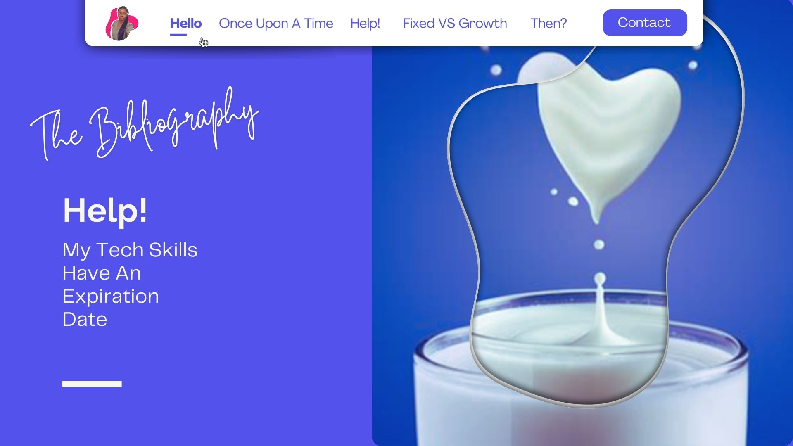

<!-- RESOURCES COVER -->

<div style="background-color: #F6F3FF; padding: 20px" class="markdown-body">
<p align="center" style="margin-top: -15px">
  <a href="https://github.com/HelviraG/conferences.resources/blob/main/%5BEN%5Dtech_skills_expiration/README.md">
    
  </a>
</p>

  <p align="center">
    All the resources you need to go further and beyond after the conference 😉!
    <br />
    <br />
    <a href="https://helvirag.github.io" style="padding: 6px 12px; color: black" onmouseover="this.style.color='purple'; this.style.fontWeight=''" onmouseleave="this.style.color='black'">🌐 Website</a>
    ·
    <a href="https://linkedin.com/helvira-dev" style="padding: 6px 12px; color: black" onmouseover="this.style.color='purple';fontSize=''" onmouseleave="this.style.color='black'; this.style.fontWeight='normal'; fontSize='12px'"> Linkedin</a>
    ·
    <a href="https://twitter.com/helvira_g" style="padding: 6px 12px; color: black" onmouseover="this.style.color='purple';" onmouseleave="this.style.color='black'">Twitter/X</a>
    ·
    <a href="https://www.buymeacoffee.com/helvira" style="padding: 6px 12px; color: black" onmouseover="this.style.color='purple';" onmouseleave="this.style.color='black'">🥤 Buy me a coffee</a>
  </p>

  <br />

## Abstract:

```
One day, you’re a cutting-edge developer. The next, you blink, and suddenly your favorite framework is “legacy,” job postings demand skills you’ve never heard of, and juniors are asking if you “really used jQuery back in the day.”

In a world where tech moves faster than a CI/CD pipeline on caffeine; how do developers keep up without losing their sanity?

This talk takes a humorous dive into the fear of becoming outdated, the questionable ways we try to stay relevant, and the surprising truth about what actually matters in the long run.

Through real stories, developer confessions, and a few existential crises about AI taking our jobs, we’ll uncover how to future-proof yourself—without falling into the trap of learning every new JavaScript framework just because Twitter says so.

If you’ve ever wondered whether you’re “falling behind” or if you (really) need to learn Rust, this talk is for you.

```

</div>