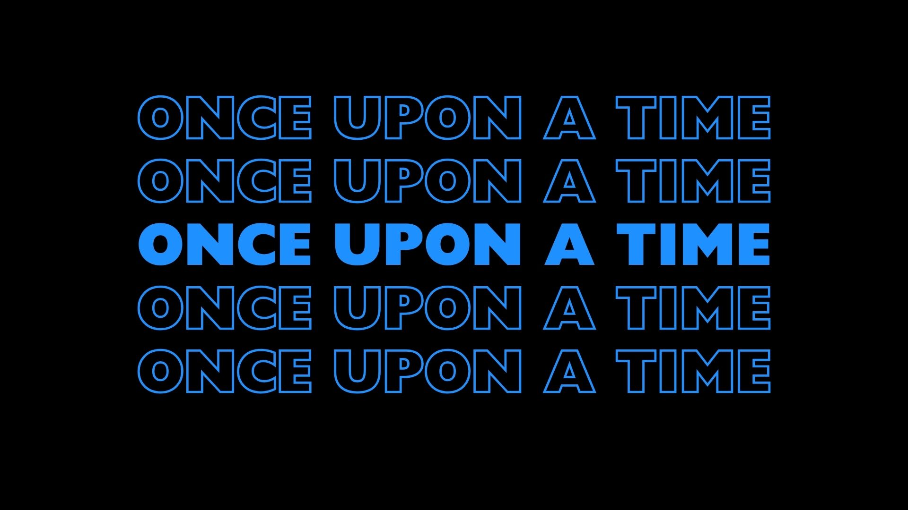
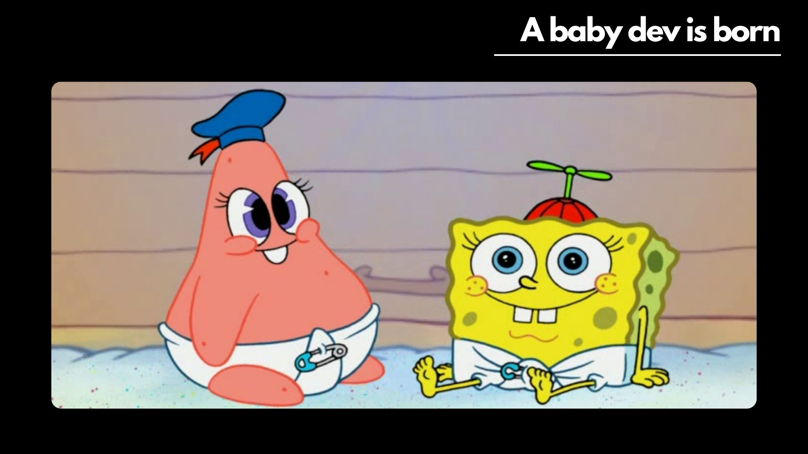
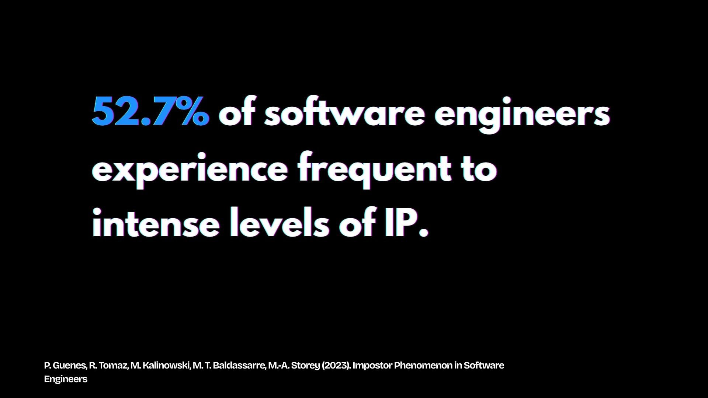
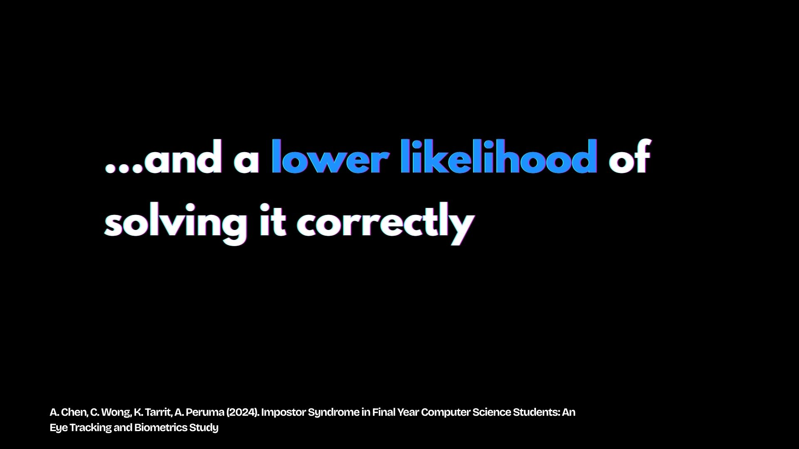
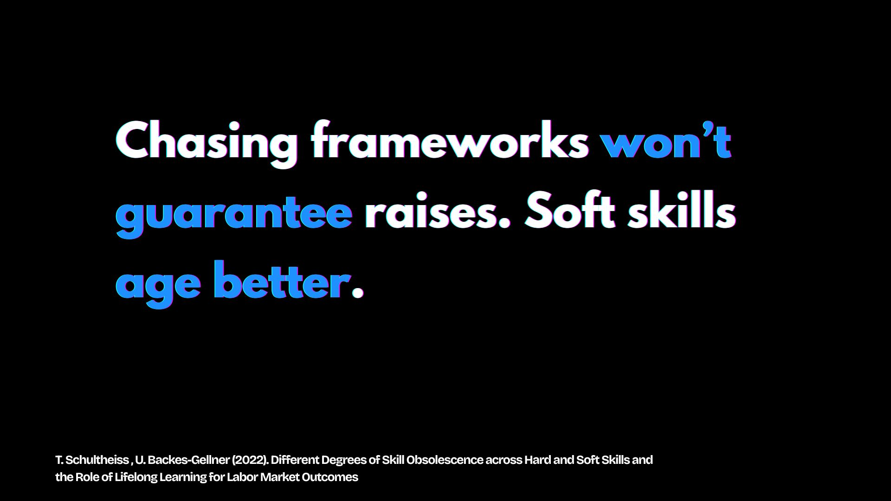
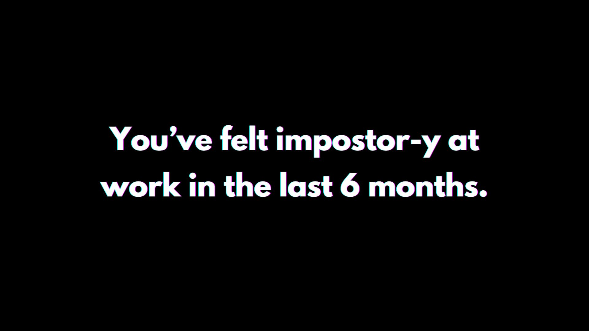
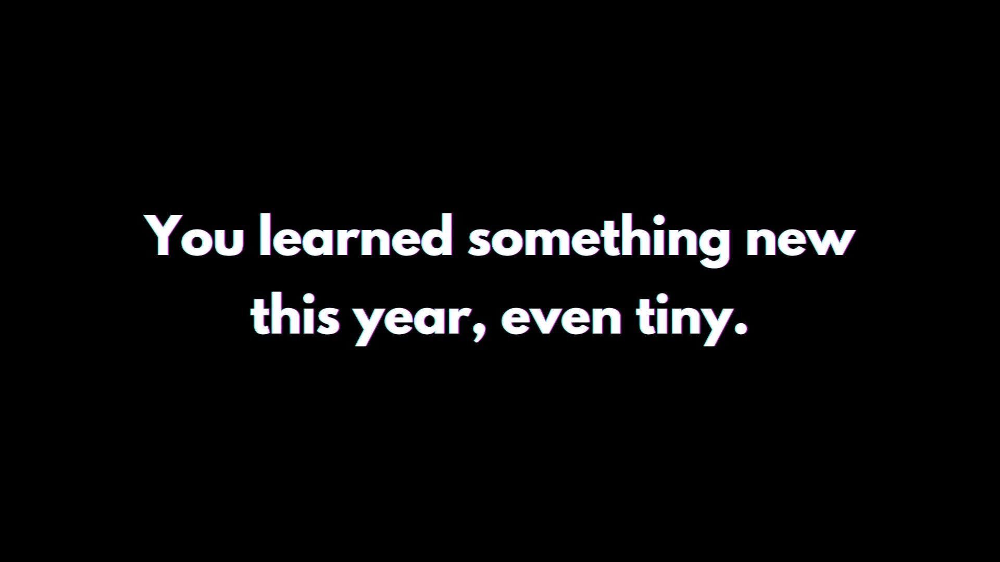

<!-- RESOURCES COVER -->

  

  

    All the resources you need to go further and beyond after the conference 😉!
     
     
    <a href="https://helvira.dev" style="padding: 6px 12px; color: black" onmouseover="this.style.color='purple'; this.style.fontWeight=''" onmouseleave="this.style.color='black'">🌐 Website</a>
    ·
    <a href="https://linkedin.com/helvira-dev" style="padding: 6px 12px; color: black" onmouseover="this.style.color='purple';fontSize=''" onmouseleave="this.style.color='black'; this.style.fontWeight='normal'; fontSize='12px'"> Linkedin</a>
    ·
    <a href="https://twitter.com/helvira_g" style="padding: 6px 12px; color: black" onmouseover="this.style.color='purple';" onmouseleave="this.style.color='black'">Twitter/X</a>
    ·
    <a href="https://www.buymeacoffee.com/helvira" style="padding: 6px 12px; color: black" onmouseover="this.style.color='purple';" onmouseleave="this.style.color='black'">🥤 Buy me a coffee</a>
  

   

  <!-- TABLE OF CONTENTS -->
#### Table of Contents

  <ol style="list-style-type: none; margin-top: 40px;">
    <li>
      <!-- SCIENTIFIC PRESS SECTION -->
      

        

          <a href="https://github.com/HelviraG/conferences.resources/blob/main/%5BEN%5Dtech_skills_expiration/sections/PaperAssets.md#%EF%B8%8F-paper-assets" style="color: black" onmouseover="this.style.fontWeight='700';this.style.color='#6A42AB';" onmouseout="this.style.fontWeight='';this.style.color='black';">📰 Paper Assets</a>
        

          <ul style="list-style-type: none">
            <!-- USED DURING PRESENTATION SECTION -->
            

            

              <a href="https://github.com/HelviraG/conferences.resources/blob/main/%5BEN%5Dtech_skills_expiration/sections/PaperAssets.md#%EF%B8%8F-paper-assets" style="color: black" onmouseover="this.style.fontWeight='700';this.style.color='#6A42AB';" onmouseout="this.style.fontWeight='';this.style.color='black';">Seen through the presentation</a>
            

            <ul style="list-style-type: none">
                <li style="margin-top: 10px">
                    <a href="https://github.com/HelviraG/conferences.resources/blob/main/%5BEN%5Dtech_skills_expiration/sections/PaperAssets.md#%EF%B8%8F-impostor-phenomenon-in-software-engineers" style="color: black" onmouseover="this.style.fontWeight='700';this.style.color='#6A42AB';" onmouseout="this.style.fontWeight='';this.style.color='black';">🧷 Impostor Phenomenon in Software Engineers</a>
                </li>
                <li style="margin-top: 10px">
                    <a href="https://github.com/HelviraG/conferences.resources/blob/main/%5BEN%5Dtech_skills_expiration/sections/PaperAssets.md#%EF%B8%8F-impostor-syndrome-in-final-year-computer-science-students-an-eye-tracking-and-biometrics-study" style="color: black" onmouseover="this.style.fontWeight='700';this.style.color='#6A42AB';" onmouseout="this.style.fontWeight='';this.style.color='black';">🧷 Impostor Syndrome in Final Year Computer Science Students: An Eye Tracking and Biometrics Study</a>
                </li>
                <li style="margin-top: 10px">
                    <a href="https://github.com/HelviraG/conferences.resources/blob/main/%5BEN%5Dtech_skills_expiration/sections/PaperAssets.md#%EF%B8%8F-different-degrees-of-skill-obsolescence-across-hard-and-soft-skills-and-the-role-of-lifelong-learning-for-labor-market-outcomes" style="color: black" onmouseover="this.style.fontWeight='700';this.style.color='#6A42AB';" onmouseout="this.style.fontWeight='';this.style.color='black';">🧷 Different Degrees of Skill Obsolescence across Hard and Soft Skills and the Role of Lifelong Learning for Labor Market Outcomes</a>
                </li>
                <li style="margin-top: 10px">
                    <a href="https://github.com/HelviraG/conferences.resources/blob/main/%5BEN%5Dtech_skills_expiration/sections/PaperAssets.md#%EF%B8%8F-computerization-obsolescence-and-the-length-of-working-life" style="color: black" onmouseover="this.style.fontWeight='700';this.style.color='#6A42AB';" onmouseout="this.style.fontWeight='';this.style.color='black';">🧷 Computerization, obsolescence and the length of working life</a>
                </li>
                <li style="margin-top: 10px">
                    <a href="https://github.com/HelviraG/conferences.resources/blob/main/%5BEN%5Dtech_skills_expiration/sections/PaperAssets.md#%EF%B8%8F-leveraging-a-dualfocused-growth-mindset-to-boost-employee-resilience-and-work-wellbeing-evidence-from-a-twowave-survey-and-an-intervention-study" style="color: black" onmouseover="this.style.fontWeight='700';this.style.color='#6A42AB';" onmouseout="this.style.fontWeight='';this.style.color='black';">🧷 Leveraging a Dual‐Focused Growth Mindset to Boost Employee Resilience and Work Well‐Being: Evidence From a Two‐Wave Survey and an Intervention Study</a>
                </li>
            </ul>
            

            <!-- MORE TO READ SECTION -->
            

            

              <a href="https://github.com/HelviraG/conferences.resources/blob/main/%5BEN%5Dtech_skills_expiration/sections/PaperAssets.md#-read-more" style="color: black" onmouseover="this.style.fontWeight='700';this.style.color='#6A42AB';" onmouseout="this.style.fontWeight='';this.style.color='black';">🔎 More to read</a>
            

            <ul style="list-style-type: none">
              <li style="margin-top: 8px">
                <a href="https://github.com/HelviraG/conferences.resources/blob/main/%5BEN%5Dtech_skills_expiration/sections/PaperAssets.md#%EF%B8%8F-wanted-self-doubting-employeesmanagers-scoring-positively-on-impostorism-favor-insecure-employees-in-task-delegation" style="color: black" onmouseover="this.style.fontWeight='700';this.style.color='#6A42AB';" onmouseout="this.style.fontWeight='';this.style.color='black';">🧷 Wanted: Self-doubting employees—Managers scoring positively on impostorism favor insecure employees in task delegation</a>
              </li>
              <li style="margin-top: 8px">
                <a href="https://github.com/HelviraG/conferences.resources/blob/main/%5BEN%5Dtech_skills_expiration/sections/PaperAssets.md#%EF%B8%8F-%EF%B8%8F%EF%B8%8F-the-phenomenology-of-the-impostor-phenomenon" style="color: black" onmouseover="this.style.fontWeight='700';this.style.color='#6A42AB';" onmouseout="this.style.fontWeight='';this.style.color='black';">🧷 The phenomenology of the impostor phenomenon</a>
              </li>
              <li style="margin-top: 8px">
                <a href="https://github.com/HelviraG/conferences.resources/blob/main/%5BEN%5Dtech_skills_expiration/sections/PaperAssets.md#%EF%B8%8F-%EF%B8%8F%EF%B8%8F-growing-a-growth-mindset-characterizing-how-and-why-undergraduate-students-mindsets-change" style="color: black" onmouseover="this.style.fontWeight='700';this.style.color='#6A42AB';" onmouseout="this.style.fontWeight='';this.style.color='black';">🧷 Growing a growth mindset: characterizing how and why undergraduate students’ mindsets change</a>
              </li>
              <li style="margin-top: 8px">
                <a href="https://github.com/HelviraG/conferences.resources/blob/main/%5BEN%5Dtech_skills_expiration/sections/PaperAssets.md#%EF%B8%8F-%EF%B8%8F%EF%B8%8F-transforming-software-development-evaluating-the-efficiency-and-challenges-of-github-copilot-in-real-world-projects" style="color: black" onmouseover="this.style.fontWeight='700';this.style.color='#6A42AB';" onmouseout="this.style.fontWeight='';this.style.color='black';">🧷 Transforming Software Development: Evaluating the Efficiency and Challenges of GitHub Copilot in Real-World Projects</a>
              </li>
              <li style="margin-top: 8px">
                <a href="https://github.com/HelviraG/conferences.resources/blob/main/%5BEN%5Dtech_skills_expiration/sections/PaperAssets.md#%EF%B8%8F-%EF%B8%8F%EF%B8%8F-assessing-obsolescence-of-software-engineers" style="color: black" onmouseover="this.style.fontWeight='700';this.style.color='#6A42AB';" onmouseout="this.style.fontWeight='';this.style.color='black';">🧷 Assessing Obsolescence of Software Engineers</a>
              </li>
            </ul>
            

          </ul>
      

    </li>
  </ol>
   

### 💽 Presentation Slides

    
Check the slides 🤨🧐

    <ul>
        <li>
            
            
           
           
            
            
            
            
            
            
            
            
            
            
            
            
            
            
            
            
            
            
            
            
            
            
            
            
            
            
            
            
            
            
            
            
            
            
            
            
            
            
        </li>
    </ul>

