<!-- RESOURCES COVER -->
<div style="background-color: #F6F3FF; padding: 20px" class="markdown-body">
<p style="margin-top: -15px">
  <a href="https://github.com/HelviraG/conferences.resources/blob/main/%5BEN%5Dtech_skills_expiration/events/api_platform_conference/README.md">
    
  </a>
</p>

  <p align="center">
    All the resources you need to go further and beyond after the conference 😉!
    <br />
    <br />
    <a href="https://helvira.dev" style="padding: 6px 12px; color: black" onmouseover="this.style.color='purple'; this.style.fontWeight=''" onmouseleave="this.style.color='black'">🌐 Website</a>
    ·
    <a href="https://linkedin.com/helvira-dev" style="padding: 6px 12px; color: black" onmouseover="this.style.color='purple';fontSize=''" onmouseleave="this.style.color='black'; this.style.fontWeight='normal'; fontSize='12px'"> Linkedin</a>
    ·
    <a href="https://twitter.com/helvira_g" style="padding: 6px 12px; color: black" onmouseover="this.style.color='purple';" onmouseleave="this.style.color='black'">Twitter/X</a>
    ·
    <a href="https://bsky.app/profile/helvira.bsky.social" style="padding: 6px 12px; color: black" onmouseover="this.style.color='purple';" onmouseleave="this.style.color='black'">Bluesky</a>
    ·
    <a href="https://www.buymeacoffee.com/helvira" style="padding: 6px 12px; color: black" onmouseover="this.style.color='purple';" onmouseleave="this.style.color='black'">🥤 Buy me a coffee</a>
  </p>

  <br />

  ## Abstract:

```
One day, you’re a cutting-edge developer. The next, you blink, and suddenly your favorite framework is “legacy,” 
job postings demand skills you’ve never heard of, and juniors are asking if you 
“really used jQuery back in the day.”

In a world where tech moves faster than a CI/CD pipeline on caffeine; how do developers keep up 
without losing their sanity?

This talk takes a humorous dive into the fear of becoming outdated, the questionable ways we try 
to stay relevant, and the surprising truth about what actually matters in the long run.

Through real stories, developer confessions, and a few existential crises about AI 
taking our jobs, we’ll uncover how to future-proof yourself—without falling into the trap of 
learning every new JavaScript framework just because Twitter says so.

If you’ve ever wondered whether you’re “falling behind” or if you (really) need to learn Rust, 
this talk is for you.

```

<br />

  <!-- TABLE OF CONTENTS -->
#### Table of Contents

  <ol style="list-style-type: none; margin-top: 40px;">
    <li>
      <!-- SCIENTIFIC PRESS SECTION -->
      <details>
        <summary>
          <a href="https://github.com/HelviraG/conferences.resources/blob/main/%5BEN%5Dtech_skills_expiration/sections/PaperAssets.md#%EF%B8%8F-paper-assets" style="color: black" onmouseover="this.style.fontWeight='700';this.style.color='#6A42AB';" onmouseout="this.style.fontWeight='';this.style.color='black';">📰 Paper Assets</a>
        </summary>
          <ul style="list-style-type: none">
            <!-- USED DURING PRESENTATION SECTION -->
            <details style="margin-top: 20px">
            <summary>
              <a href="https://github.com/HelviraG/conferences.resources/blob/main/%5BEN%5Dtech_skills_expiration/sections/PaperAssets.md#%EF%B8%8F-paper-assets" style="color: black" onmouseover="this.style.fontWeight='700';this.style.color='#6A42AB';" onmouseout="this.style.fontWeight='';this.style.color='black';">Seen through the presentation</a>
            </summary>
            <ul style="list-style-type: none">
                <li style="margin-top: 10px">
                    <a href="https://github.com/HelviraG/conferences.resources/blob/main/%5BEN%5Dtech_skills_expiration/sections/PaperAssets.md#%EF%B8%8F-impostor-phenomenon-in-software-engineers" style="color: black" onmouseover="this.style.fontWeight='700';this.style.color='#6A42AB';" onmouseout="this.style.fontWeight='';this.style.color='black';">🧷 Impostor Phenomenon in Software Engineers</a>
                </li>
                <li style="margin-top: 10px">
                    <a href="https://github.com/HelviraG/conferences.resources/blob/main/%5BEN%5Dtech_skills_expiration/sections/PaperAssets.md#%EF%B8%8F-impostor-syndrome-in-final-year-computer-science-students-an-eye-tracking-and-biometrics-study" style="color: black" onmouseover="this.style.fontWeight='700';this.style.color='#6A42AB';" onmouseout="this.style.fontWeight='';this.style.color='black';">🧷 Impostor Syndrome in Final Year Computer Science Students: An Eye Tracking and Biometrics Study</a>
                </li>
                <li style="margin-top: 10px">
                    <a href="https://github.com/HelviraG/conferences.resources/blob/main/%5BEN%5Dtech_skills_expiration/sections/PaperAssets.md#%EF%B8%8F-different-degrees-of-skill-obsolescence-across-hard-and-soft-skills-and-the-role-of-lifelong-learning-for-labor-market-outcomes" style="color: black" onmouseover="this.style.fontWeight='700';this.style.color='#6A42AB';" onmouseout="this.style.fontWeight='';this.style.color='black';">🧷 Different Degrees of Skill Obsolescence across Hard and Soft Skills and the Role of Lifelong Learning for Labor Market Outcomes</a>
                </li>
                <li style="margin-top: 10px">
                    <a href="https://github.com/HelviraG/conferences.resources/blob/main/%5BEN%5Dtech_skills_expiration/sections/PaperAssets.md#%EF%B8%8F-computerization-obsolescence-and-the-length-of-working-life" style="color: black" onmouseover="this.style.fontWeight='700';this.style.color='#6A42AB';" onmouseout="this.style.fontWeight='';this.style.color='black';">🧷 Computerization, obsolescence and the length of working life</a>
                </li>
                <li style="margin-top: 10px">
                    <a href="https://github.com/HelviraG/conferences.resources/blob/main/%5BEN%5Dtech_skills_expiration/sections/PaperAssets.md#%EF%B8%8F-leveraging-a-dualfocused-growth-mindset-to-boost-employee-resilience-and-work-wellbeing-evidence-from-a-twowave-survey-and-an-intervention-study" style="color: black" onmouseover="this.style.fontWeight='700';this.style.color='#6A42AB';" onmouseout="this.style.fontWeight='';this.style.color='black';">🧷 Leveraging a Dual‐Focused Growth Mindset to Boost Employee Resilience and Work Well‐Being: Evidence From a Two‐Wave Survey and an Intervention Study</a>
                </li>
            </ul>
            </details>
            <!-- MORE TO READ SECTION -->
            <details style="margin-top: 20px">
            <summary>
              <a href="https://github.com/HelviraG/conferences.resources/blob/main/%5BEN%5Dtech_skills_expiration/sections/PaperAssets.md#-read-more" style="color: black" onmouseover="this.style.fontWeight='700';this.style.color='#6A42AB';" onmouseout="this.style.fontWeight='';this.style.color='black';">🔎 More to read</a>
            </summary>
            <ul style="list-style-type: none">
              <li style="margin-top: 8px">
                <a href="https://github.com/HelviraG/conferences.resources/blob/main/%5BEN%5Dtech_skills_expiration/sections/PaperAssets.md#%EF%B8%8F-wanted-self-doubting-employeesmanagers-scoring-positively-on-impostorism-favor-insecure-employees-in-task-delegation" style="color: black" onmouseover="this.style.fontWeight='700';this.style.color='#6A42AB';" onmouseout="this.style.fontWeight='';this.style.color='black';">🧷 Wanted: Self-doubting employees—Managers scoring positively on impostorism favor insecure employees in task delegation</a>
              </li>
              <li style="margin-top: 8px">
                <a href="https://github.com/HelviraG/conferences.resources/blob/main/%5BEN%5Dtech_skills_expiration/sections/PaperAssets.md#%EF%B8%8F-%EF%B8%8F%EF%B8%8F-the-phenomenology-of-the-impostor-phenomenon" style="color: black" onmouseover="this.style.fontWeight='700';this.style.color='#6A42AB';" onmouseout="this.style.fontWeight='';this.style.color='black';">🧷 The phenomenology of the impostor phenomenon</a>
              </li>
              <li style="margin-top: 8px">
                <a href="https://github.com/HelviraG/conferences.resources/blob/main/%5BEN%5Dtech_skills_expiration/sections/PaperAssets.md#%EF%B8%8F-%EF%B8%8F%EF%B8%8F-growing-a-growth-mindset-characterizing-how-and-why-undergraduate-students-mindsets-change" style="color: black" onmouseover="this.style.fontWeight='700';this.style.color='#6A42AB';" onmouseout="this.style.fontWeight='';this.style.color='black';">🧷 Growing a growth mindset: characterizing how and why undergraduate students’ mindsets change</a>
              </li>
              <li style="margin-top: 8px">
                <a href="https://github.com/HelviraG/conferences.resources/blob/main/%5BEN%5Dtech_skills_expiration/sections/PaperAssets.md#%EF%B8%8F-%EF%B8%8F%EF%B8%8F-transforming-software-development-evaluating-the-efficiency-and-challenges-of-github-copilot-in-real-world-projects" style="color: black" onmouseover="this.style.fontWeight='700';this.style.color='#6A42AB';" onmouseout="this.style.fontWeight='';this.style.color='black';">🧷 Transforming Software Development: Evaluating the Efficiency and Challenges of GitHub Copilot in Real-World Projects</a>
              </li>
              <li style="margin-top: 8px">
                <a href="https://github.com/HelviraG/conferences.resources/blob/main/%5BEN%5Dtech_skills_expiration/sections/PaperAssets.md#%EF%B8%8F-%EF%B8%8F%EF%B8%8F-assessing-obsolescence-of-software-engineers" style="color: black" onmouseover="this.style.fontWeight='700';this.style.color='#6A42AB';" onmouseout="this.style.fontWeight='';this.style.color='black';">🧷 Assessing Obsolescence of Software Engineers</a>
              </li>
            </ul>
            </details>
          </ul>
      </details>
    </li>
  </ol>
  <br />

### 💽 Presentation Slides

<details>
    <summary>Check the slides 🤨🧐</summary>
    <ul>
        <li>
            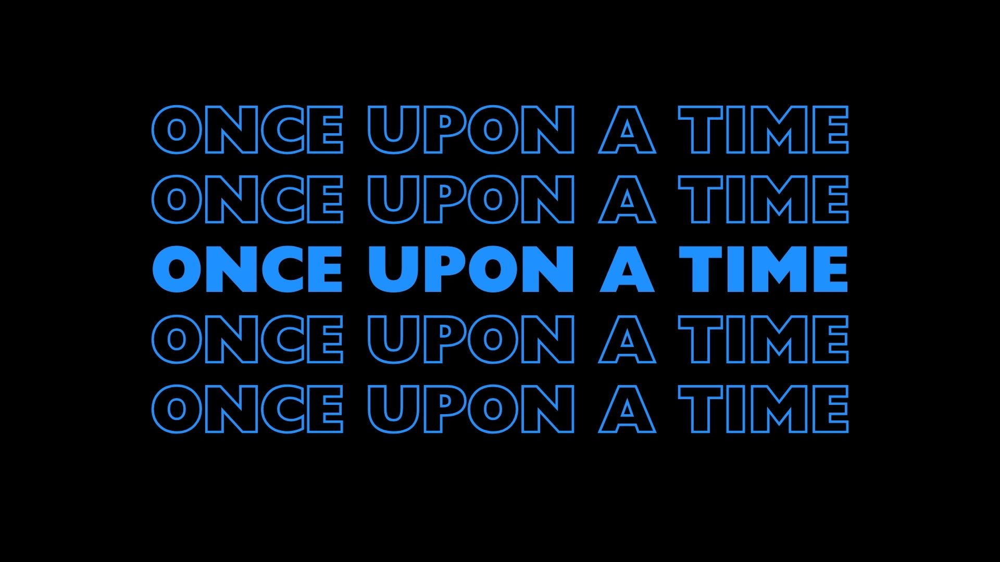
            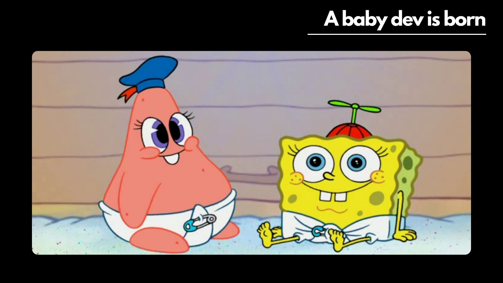
           
           
            
            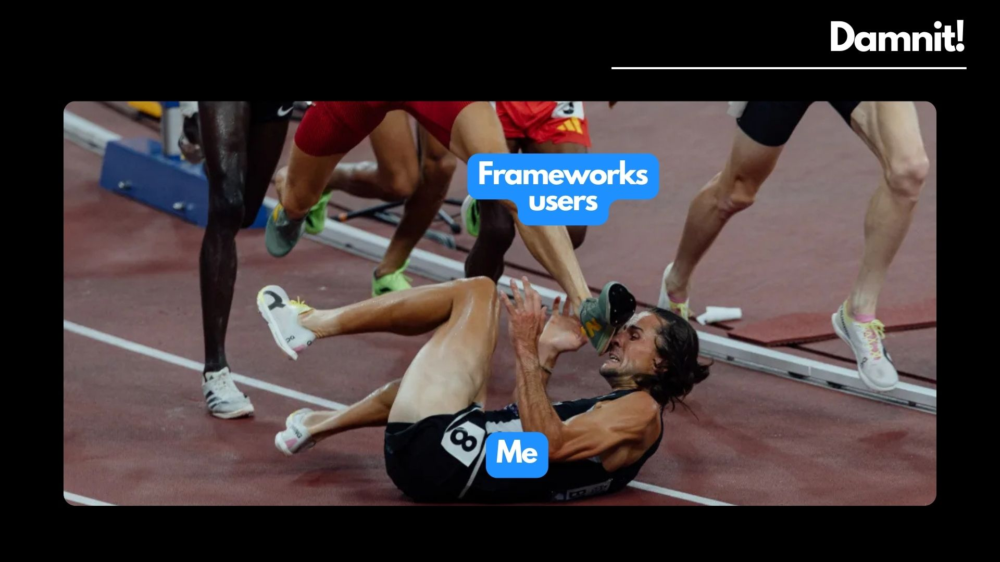
            
            
            
            
            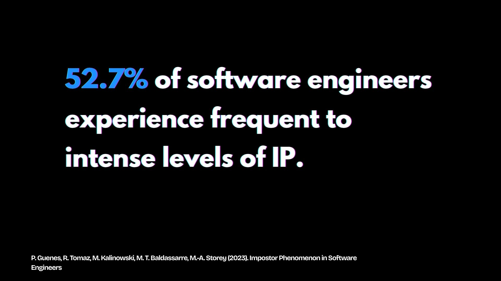
            
            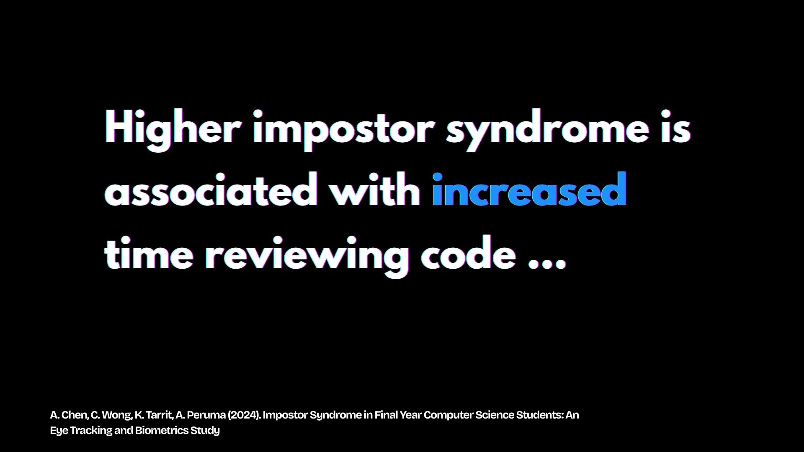
            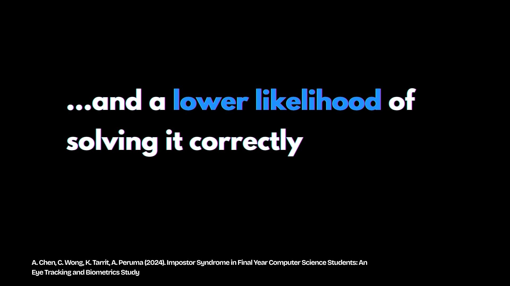
            
            
            
            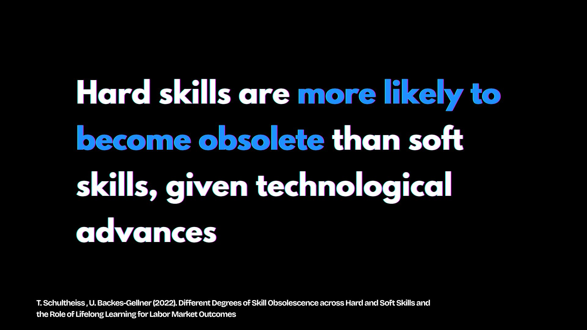
            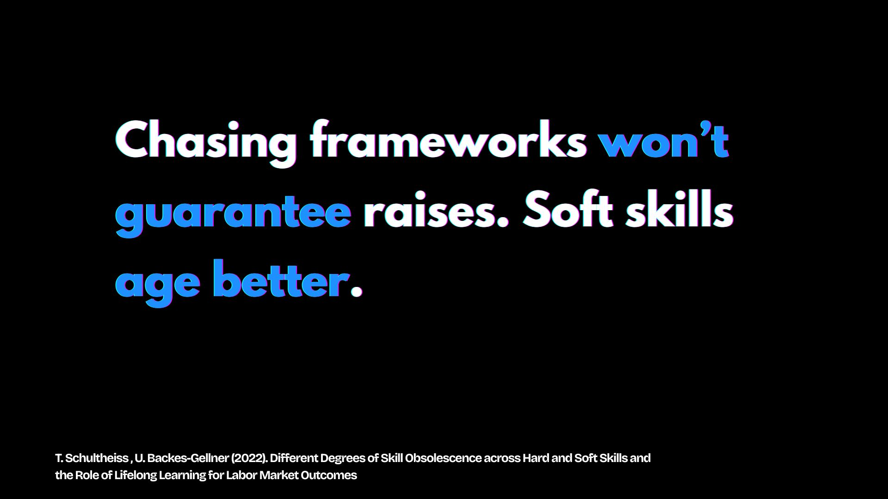
            
            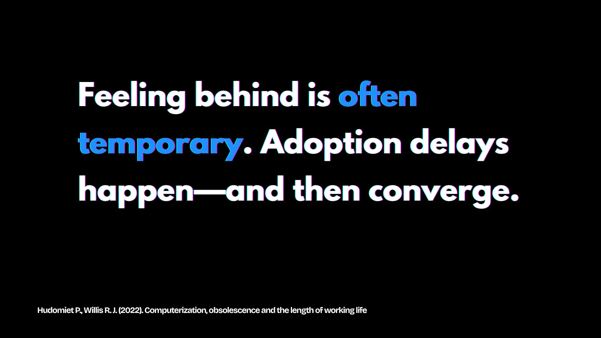
            
            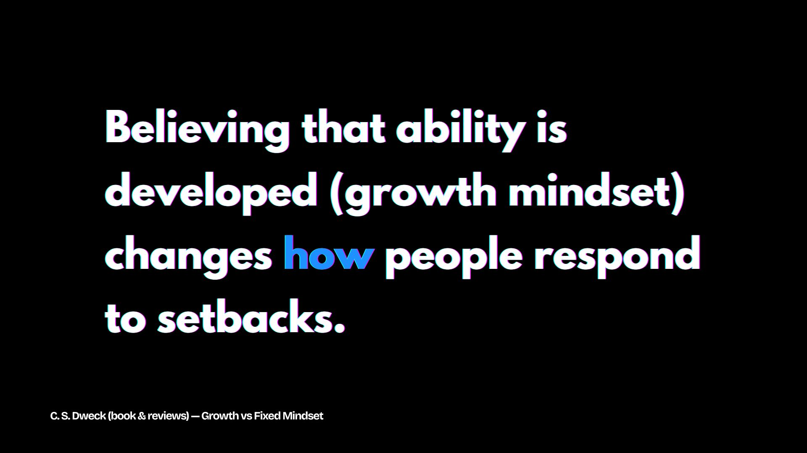
            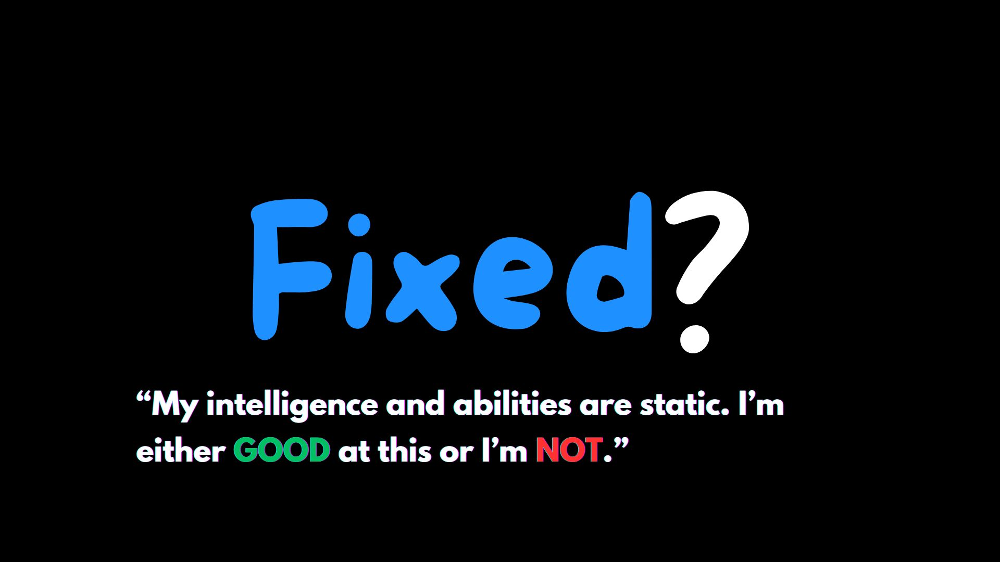
            
            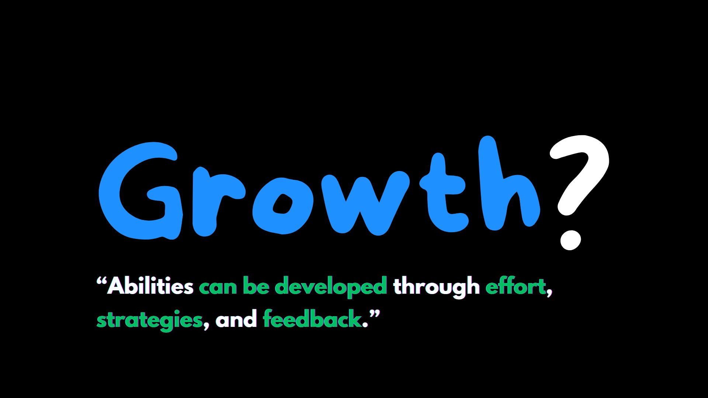
            
            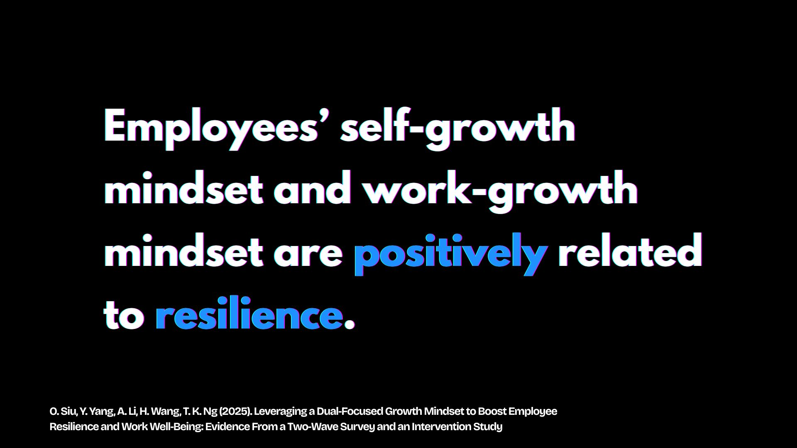
            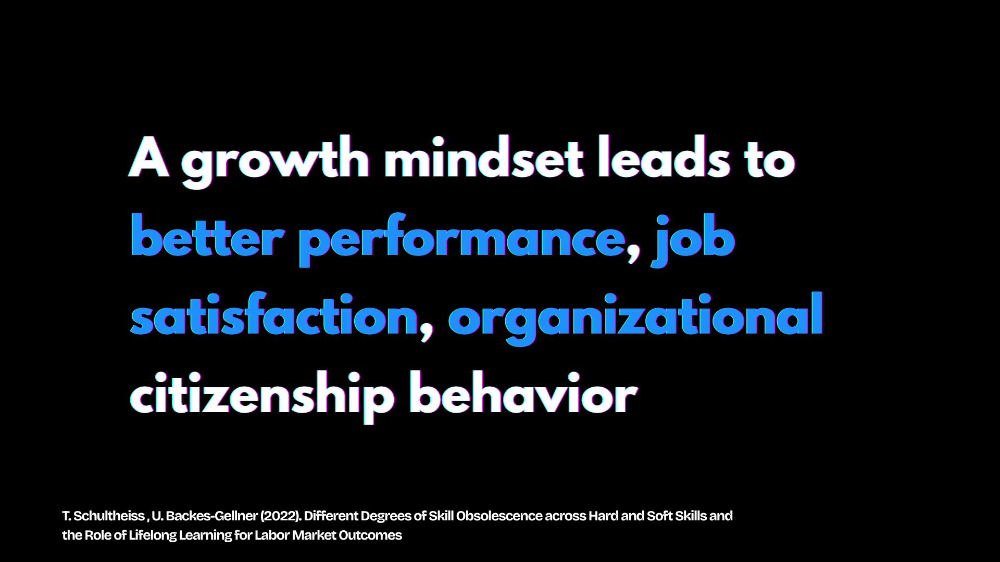
            
            
            
            
            
            
            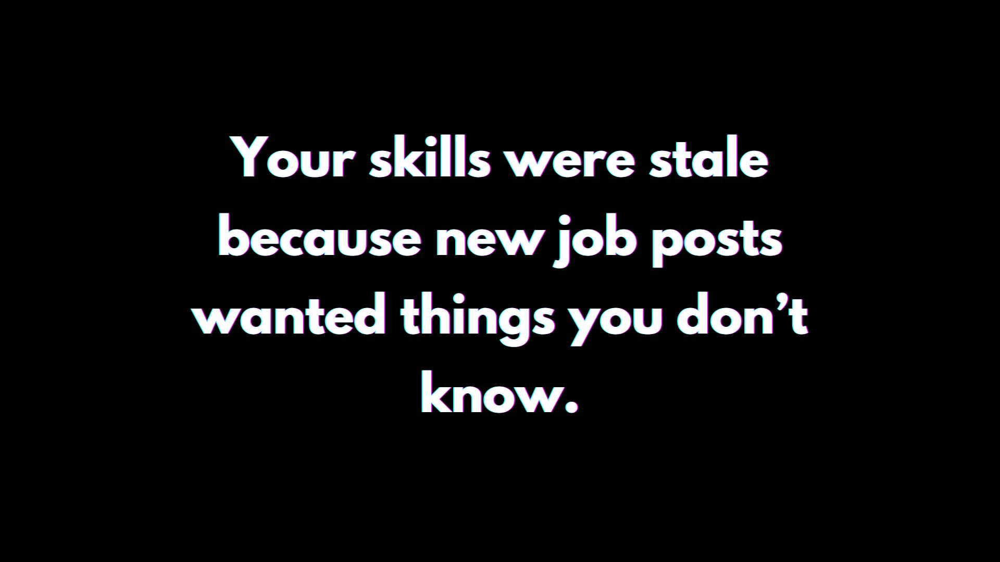
            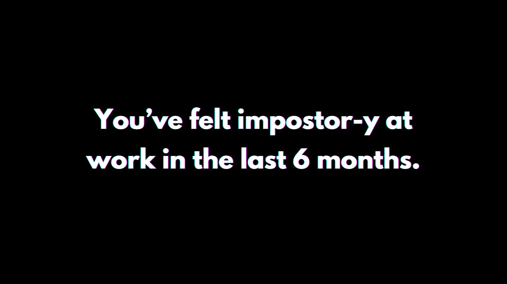
            
            
            
            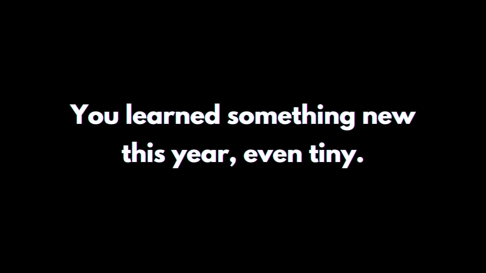
            
        </li>
    </ul>
</details>

</div>