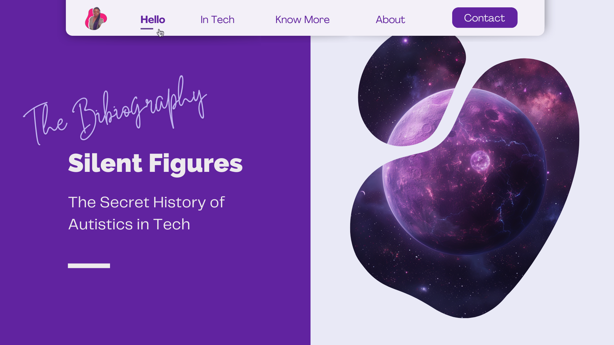

<!-- SHORTLINKS -->
<!-- PAPERS -->
[paper-assets]: https://github.com/HelviraG/conferences.resources/tree/main/silent_figures/sections/PaperAssets.md#paper-assets
[for-presentation]: https://github.com/HelviraG/conferences.resources/tree/main/silent_figures/sections/PaperAssets.md#for-presentation
[live-extreme]: https://github.com/HelviraG/conferences.resources/tree/main/silent_figures/sections/PaperAssets.md#live-extreme
[interact-judgement]: https://github.com/HelviraG/conferences.resources/tree/main/silent_figures/sections/PaperAssets.md#interact-judgement
[competitive-advantage]: https://github.com/HelviraG/conferences.resources/tree/main/silent_figures/sections/PaperAssets.md#competitive-advantage
[perspective-futur]: https://github.com/HelviraG/conferences.resources/tree/main/silent_figures/sections/PaperAssets.md#perspective-futur
[autism-workforce]: https://github.com/HelviraG/conferences.resources/tree/main/silent_figures/sections/PaperAssets.md#autism-workforce
[redefine-talents]: https://github.com/HelviraG/conferences.resources/tree/main/silent_figures/sections/PaperAssets.md#redefine-talents
[what-works]: https://github.com/HelviraG/conferences.resources/tree/main/silent_figures/sections/PaperAssets.md#what-works
[tech-careers]: https://github.com/HelviraG/conferences.resources/tree/main/silent_figures/sections/PaperAssets.md#tech-careers
[challenges-faced]: https://github.com/HelviraG/conferences.resources/tree/main/silent_figures/sections/PaperAssets.md#challenges-faced
[benefits-talent]: https://github.com/HelviraG/conferences.resources/tree/main/silent_figures/sections/PaperAssets.md#benefits-talent 
[autistic-myths]: https://github.com/HelviraG/conferences.resources/tree/main/silent_figures/sections/PaperAssets.md#autistic-myths

<!-- READ MORE -->
[autistic-child]: https://github.com/HelviraG/conferences.resources/tree/main/silent_figures/sections/PaperAssets.md#autistic-child 
[no-way]: https://github.com/HelviraG/conferences.resources/tree/main/silent_figures/sections/ReadMoreAssets.md#no-way
[microsoft-autism-program]: https://github.com/HelviraG/conferences.resources/tree/main/silent_figures/sections/ReadMoreAssets.md#microsoft-autism-program
[own-term]: https://github.com/HelviraG/conferences.resources/tree/main/silent_figures/sections/ReadMoreAssets.md#own-term
[read-more]: https://github.com/HelviraG/conferences.resources/tree/main/silent_figures/sections/ReadMoreAssets.md#read-more
[machine-learning]: https://github.com/HelviraG/conferences.resources/tree/main/silent_figures/sections/ReadMoreAssets.md#machine-learning
[coding-horror]: https://github.com/HelviraG/conferences.resources/tree/main/silent_figures/sections/ReadMoreAssets.md#coding-horror
[neil-barnett-talk]: https://github.com/HelviraG/conferences.resources/tree/main/silent_figures/sections/ReadMoreAssets.md#neil-barnett-talk
[computer-genius]: https://github.com/HelviraG/conferences.resources/tree/main/silent_figures/sections/ReadMoreAssets.md#computer-genius 
[potential-genius]: https://github.com/HelviraG/conferences.resources/tree/main/silent_figures/sections/ReadMoreAssets.md#potential-genius 
[famous-autism]: https://github.com/HelviraG/conferences.resources/tree/main/silent_figures/sections/ReadMoreAssets.md#famous-autism 
[famous-people]: https://github.com/HelviraG/conferences.resources/tree/main/silent_figures/sections/ReadMoreAssets.md#famous-people 

<!-- IMAGES -->
[images-assets]: https://github.com/HelviraG/conferences.resources/tree/main/silent_figures/sections/ImagesAssets.md#images-assets 
[midjourney-images]: https://github.com/HelviraG/conferences.resources/tree/main/silent_figures/sections/ImagesAssets.md#midjourney-images 
[planet-image]: https://github.com/HelviraG/conferences.resources/tree/main/silent_figures/sections/ImagesAssets.md#planet-image 
[zepharians]: https://github.com/HelviraG/conferences.resources/tree/main/silent_figures/sections/ImagesAssets.md#zepharians 
[jcon-spaceship]: https://github.com/HelviraG/conferences.resources/tree/main/silent_figures/sections/ImagesAssets.md#jcon-spaceship 
[scuba-diving]: https://github.com/HelviraG/conferences.resources/tree/main/silent_figures/sections/ImagesAssets.md#scuba-diving 
[book-forest]: https://github.com/HelviraG/conferences.resources/tree/main/silent_figures/sections/ImagesAssets.md#book-forest 
[autistic-people]: https://github.com/HelviraG/conferences.resources/tree/main/silent_figures/sections/ImagesAssets.md#autistic-people 

[susan-boyle]: https://github.com/HelviraG/conferences.resources/tree/main/silent_figures/sections/ImagesAssets.md#susan-boyle
[external-images]: https://github.com/HelviraG/conferences.resources/tree/main/silent_figures/sections/ImagesAssets.md#external-images 
[dennis-ritchie]: https://github.com/HelviraG/conferences.resources/tree/main/silent_figures/sections/ImagesAssets.md#dennis-ritchie 
[mark-zuckerberg]: https://github.com/HelviraG/conferences.resources/tree/main/silent_figures/sections/ImagesAssets.md#mark-zuckerberg 
[captain-spoke]: https://github.com/HelviraG/conferences.resources/tree/main/silent_figures/sections/ImagesAssets.md#captain-spoke

<!-- VIDEOS -->
[true-calling]: https://github.com/HelviraG/conferences.resources/tree/main/silent_figures/sections/VideoAssets.md
[ted-autism-wrong]: https://github.com/HelviraG/conferences.resources/tree/main/silent_figures/sections/VideoAssets.md
[diagnosis-invite]: https://github.com/HelviraG/conferences.resources/tree/main/silent_figures/sections/VideoAssets.md
[be-normal]: https://github.com/HelviraG/conferences.resources/tree/main/silent_figures/sections/VideoAssets.md
[being-human]: https://github.com/HelviraG/conferences.resources/tree/main/silent_figures/sections/VideoAssets.md
[worlds-minds]: https://github.com/HelviraG/conferences.resources/tree/main/silent_figures/sections/VideoAssets.md
[feels-autistic]: https://github.com/HelviraG/conferences.resources/tree/main/silent_figures/sections/VideoAssets.md
[video-assets]: https://github.com/HelviraG/conferences.resources/tree/main/silent_figures/sections/VideoAssets.md#video-assets

<!-- RESOURCES COVER -->

  

  

    All the resources you need to go further and beyond after the conference 😉!
     
     
    <a href="https://helvirag.github.io" style="padding: 6px 12px; color: black" onmouseover="this.style.color='purple'; this.style.fontWeight=''" onmouseleave="this.style.color='black'">🌐 Website</a>
    ·
    <a href="https://linkedin.com/helvira-dev" style="padding: 6px 12px; color: black" onmouseover="this.style.color='purple';fontSize=''" onmouseleave="this.style.color='black'; this.style.fontWeight='normal'; fontSize='12px'"> Linkedin</a>
    ·
    <a href="https://twitter.com/helvira_g" style="padding: 6px 12px; color: black" onmouseover="this.style.color='purple';" onmouseleave="this.style.color='black'">Twitter/X</a>
    ·
    <a href="https://www.buymeacoffee.com/helvira" style="padding: 6px 12px; color: black" onmouseover="this.style.color='purple';" onmouseleave="this.style.color='black'">🥤 Buy me a coffee</a>
  

   

  <!-- TABLE OF CONTENTS -->
  #### Table of Contents

  <ol style="list-style-type: none; margin-top: 40px;">
    <li>
      <!-- SCIENTIFIC PRESS SECTION -->
      

        

          <a href="paper-assets" style="color: black" onmouseover="this.style.fontWeight='700';this.style.color='#6A42AB';" onmouseout="this.style.fontWeight='';this.style.color='black';">📰 Paper Assets</a>
        

          <ul style="list-style-type: none">
            <!-- USED DURING PRESENTATION SECTION -->
            

            

              <a href="paper-assets" style="color: black" onmouseover="this.style.fontWeight='700';this.style.color='#6A42AB';" onmouseout="this.style.fontWeight='';this.style.color='black';">Seen through the presentation</a>
            

            <ul style="list-style-type: none">
              <li style="margin-top: 10px">
                <a href="interact-judgement" style="color: black" onmouseover="this.style.fontWeight='700';this.style.color='#6A42AB';" onmouseout="this.style.fontWeight='';this.style.color='black';">🧷 Neurotypical Peers are Less Willing to Interact with Those with Autism based on Thin Slice Judgments</a>
              </li>
              <li style="margin-top: 10px">
                <a href="competitive-advantage" style="color: black" onmouseover="this.style.fontWeight='700';this.style.color='#6A42AB';" onmouseout="this.style.fontWeight='';this.style.color='black';">🧷 Neurodiversity as a Competitive Advantage - Why you should embrace it in your workforce</a>
              </li>
              <li style="margin-top: 10px">
                <a href="#perspective-futur" style="color: black" onmouseover="this.style.fontWeight='700';this.style.color='#6A42AB';" onmouseout="this.style.fontWeight='';this.style.color='black';">🧷 Employees With Autism Spectrum Disorders in the Digitized Work Environment: Perspectives for the Future</a>
              </li>
              <li style="margin-top: 10px">
                <a href="#autism-workforce" style="color: black" onmouseover="this.style.fontWeight='700';this.style.color='#6A42AB';" onmouseout="this.style.fontWeight='';this.style.color='black';">🧷 Autism in the workforce: A case study</a>
              </li>
              <li style="margin-top: 10px">
                <a href="#redefine-talents" style="color: black" onmouseover="this.style.fontWeight='700';this.style.color='#6A42AB';" onmouseout="this.style.fontWeight='';this.style.color='black';">🧷 It’s Not Just About Attention to Details: Redefining the Talents Autistic Software Developers Bring to Software Development</a>
              </li>
              <li style="margin-top: 10px">
                <a href="what-works" style="color: black" onmouseover="this.style.fontWeight='700';this.style.color='#6A42AB';" onmouseout="this.style.fontWeight='';this.style.color='black';">🧷 Autism and employment: What works</a>
              </li>
              <li style="margin-top: 10px">
                <a href="tech-careers" style="color: black" onmouseover="this.style.fontWeight='700';this.style.color='#6A42AB';" onmouseout="this.style.fontWeight='';this.style.color='black';">🧷 How To Create More Tech Careers For Autistic Individuals</a>
              </li>
              <li style="margin-top: 10px">
                <a href="autistic-myths" style="color: black" onmouseover="this.style.fontWeight='700';this.style.color='#6A42AB';" onmouseout="this.style.fontWeight='';this.style.color='black';">🧷 Dispelling some myths about the autistic wunderkind programmer</a>
              </li>
              <li style="margin-top: 10px">
              <a href="challenges-faced" style="color: black" onmouseover="this.style.fontWeight='700';this.style.color='#6A42AB';" onmouseout="this.style.fontWeight='';this.style.color='black';">🧷 Understanding the Challenges Faced by Neurodiverse Software Engineering Employees: Towards a More Inclusive and Productive Technical Workforce</a>
              </li>
              <li style="margin-top: 10px">
              <a href="autism-workplace" style="color: black" onmouseover="this.style.fontWeight='700';this.style.color='#6A42AB';" onmouseout="this.style.fontWeight='';this.style.color='black';">🧷 Autism in the Workplace: The Benefits of Autistic Talent in Tech</a>
              </li>
            </ul>
            

            <!-- MORE TO READ SECTION -->
            

            

              <a href="read-more" style="color: black" onmouseover="this.style.fontWeight='700';this.style.color='#6A42AB';" onmouseout="this.style.fontWeight='';this.style.color='black';">🔎 More to read</a>
            

            <ul style="list-style-type: none">
              <li style="margin-top: 8px">
                <a href="no-way" style="color: black" onmouseover="this.style.fontWeight='700';this.style.color='#6A42AB';" onmouseout="this.style.fontWeight='';this.style.color='black';">🧷 ‘No Way Out Except From External Intervention’: First-Hand Accounts of Autistic Inertia</a>
              </li>
              <li style="margin-top: 10px">
                <a href="own-term" style="color: black" onmouseover="this.style.fontWeight='700';this.style.color='#6A42AB';" onmouseout="this.style.fontWeight='';this.style.color='black';">🧷 On our own terms: Emerging autistic culture</a>
              </li>
              <li style="margin-top: 10px">
                <a href="machine-learning" style="color: black" onmouseover="this.style.fontWeight='700';this.style.color='#6A42AB';" onmouseout="this.style.fontWeight='';this.style.color='black';">🧷 Developing Employment Environments Where Individuals with ASD Thrive: Using Machine Learning to Explore Employer Policies and Practices</a>
              </li>
              <li style="margin-top: 10px">
                <a href="microsoft-autism-program" style="color: black" onmouseover="this.style.fontWeight='700';this.style.color='#6A42AB';" onmouseout="this.style.fontWeight='';this.style.color='black';">🧷 Microsoft Autism Hiring Program - Inclusive Hiring for People with Disabilities</a>
              </li>
              <li style="margin-top: 10px">
                <a href="coding-horror" style="color: black" onmouseover="this.style.fontWeight='700';this.style.color='#6A42AB';" onmouseout="this.style.fontWeight='';this.style.color='black';">🧷 Software Developers and Asperger's Syndrome</a>
              </li>
              <li style="margin-top: 10px">
                <a href="neil-barnett-talk" style="color: black" onmouseover="this.style.fontWeight='700';this.style.color='#6A42AB';" onmouseout="this.style.fontWeight='';this.style.color='black';">🧷 Microsoft Inclusive Hiring And Accessibility Boss Neil Barnett Talks Embracing Neurodiverse Workers, New Neurodiversity Career Connector Tool</a>
              </li>
              <li style="margin-top: 10px">
                <a href="computer-genius" style="color: black" onmouseover="this.style.fontWeight='700';this.style.color='#6A42AB';" onmouseout="this.style.fontWeight='';this.style.color='black';">🧷 Famous computer geniuses with Asperger's</a>
              </li>
              <li style="margin-top: 10px">
                <a href="potential-genius" style="color: black" onmouseover="this.style.fontWeight='700';this.style.color='#6A42AB';" onmouseout="this.style.fontWeight='';this.style.color='black';">🧷 The Potential Genius of Aspergers</a>
              </li>
              <li style="margin-top: 10px">
                <a href="famous-autism" style="color: black" onmouseover="this.style.fontWeight='700';this.style.color='#6A42AB';" onmouseout="this.style.fontWeight='';this.style.color='black';">🧷 Famous people with high functioning autism</a>
              </li>
              <li style="margin-top: 10px">
                <a href="autistic-child" style="color: black" onmouseover="this.style.fontWeight='700';this.style.color='#6A42AB';" onmouseout="this.style.fontWeight='';this.style.color='black';">🧷 Programming, A Great Hobby for an Autistic Child</a>
              </li>
              <li style="margin-top: 10px">
                <a href="famous-autistic" style="color: black" onmouseover="this.style.fontWeight='700';this.style.color='#6A42AB';" onmouseout="this.style.fontWeight='';this.style.color='black';">🧷 Famous autistic people</a>
              </li>
            </ul>
            

          </ul>
      

    </li>
    <!-- IMAGES ASSETS SECTION -->
    <li style="margin-top: 20px">
      

      

        <a href="images-assets" style="color: black" onmouseover="this.style.fontWeight='700';this.style.color='#6A42AB';" onmouseout="this.style.fontWeight='';this.style.color='black';">🎞️ Images Assets</a>
      

      <!-- MIDJOURNEY IMAGES SECTION -->
      <ul style="list-style-type: none">
        

        

          <a href="midjourney-images" style="color: black" onmouseover="this.style.fontWeight='700';this.style.color='#6A42AB';" onmouseout="this.style.fontWeight='';this.style.color='black';">👾 Midjourney Images</a>
        

        <ul style="list-style-type: none; margin-top: 6px">
          <li><a href="planet-image" style="color: black" onmouseover="this.style.fontWeight='700';this.style.color='#6A42AB';" onmouseout="this.style.fontWeight='';this.style.color='black';">📍 Planet Zepharia</a></li>
          <li style="margin-top: 2px"><a href="zepharians" style="color: black" onmouseover="this.style.fontWeight='700';this.style.color='#6A42AB';" onmouseout="this.style.fontWeight='';this.style.color='black';">📍 The Zepharians</a></li>
          <li style="margin-top: 2px"><a href="jcon-spaceship" style="color: black" onmouseover="this.style.fontWeight='700';this.style.color='#6A42AB';" onmouseout="this.style.fontWeight='';this.style.color='black';">📍 JCON Spaceship</a></li>
          <li style="margin-top: 2px"><a href="scuba-diving" style="color: black" onmouseover="this.style.fontWeight='700';this.style.color='#6A42AB';" onmouseout="this.style.fontWeight='';this.style.color='black';">📍 Scuba Diving</a></li>
          <li style="margin-top: 2px"><a href="book-forest" style="color: black" onmouseover="this.style.fontWeight='700';this.style.color='#6A42AB';" onmouseout="this.style.fontWeight='';this.style.color='black';">📍 A Book and a Forest</a></li>
          <li style="margin-top: 2px"><a href="autistic-people" style="color: black" onmouseover="this.style.fontWeight='700';this.style.color='#6A42AB';" onmouseout="this.style.fontWeight='';this.style.color='black';">📍 Autistic People</a></li>
        </ul>
        

      <!-- EXTERNAL IMAGES SECTION -->
        

        

          <a href="external-images" style="color: black" onmouseover="this.style.fontWeight='700';this.style.color='#6A42AB';" onmouseout="this.style.fontWeight='';this.style.color='black';">📎 External Images</a>
        

        <ul style="list-style-type: none; margin-top: 6px">
          <li><a href="susan-boyle" style="color: black" onmouseover="this.style.fontWeight='700';this.style.color='#6A42AB';" onmouseout="this.style.fontWeight='';this.style.color='black';">📍 Susan Boyle</a></li>
          <li style="margin-top: 2px"><a href="dennis-ritchie" style="color: black" onmouseover="this.style.fontWeight='700';this.style.color='#6A42AB';" onmouseout="this.style.fontWeight='';this.style.color='black';">📍 Denis Ritchie</a></li>
          <li style="margin-top: 2px"><a href="mark-zuckerberg" style="color: black" onmouseover="this.style.fontWeight='700';this.style.color='#6A42AB';" onmouseout="this.style.fontWeight='';this.style.color='black';">📍 Mark Zuckerberg</a></li>
          <li style="margin-top: 2px"><a href="captain-spoke" style="color: black" onmouseover="this.style.fontWeight='700';this.style.color='#6A42AB';" onmouseout="this.style.fontWeight='';this.style.color='black';">📍 Captain Spoke</a></li>
        </ul>
        

      </ul>
      

    </li>
    <!-- VIDEO ASSETS SECTION -->
    <li>
      

        

         <a href="video-assets" style="color: black" onmouseover="this.style.fontWeight='700';this.style.color='#6A42AB';" onmouseout="this.style.fontWeight='';this.style.color='black';">🍿 Video Assets</a>
        

        <ul style="list-style-type: none">
          <li style="margin-top: 8px">
            <a href="true-calling" style="color: black" onmouseover="this.style.fontWeight='700';this.style.color='#6A42AB';" onmouseout="this.style.fontWeight='';this.style.color='black';">🧷 Working in Tech with Autism | Katherine's story</a>
          </li>
          <li style="margin-top: 10px">
            <a href="be-normal" style="color: black" onmouseover="this.style.fontWeight='700';this.style.color='#6A42AB';" onmouseout="this.style.fontWeight='';this.style.color='black';">🧷 Autism: How to be normal (and why not to be)</a>
          </li>
          <li style="margin-top: 10px">
            <a href="diagnosis-invite" style="color: black" onmouseover="this.style.fontWeight='700';this.style.color='#6A42AB';" onmouseout="this.style.fontWeight='';this.style.color='black';">🧷 Why an autism diagnosis is an invitation to finally be yourself</a>
          </li>
          <li style="margin-top: 10px">
            <a href="ted-autism-wrong" style="color: black" onmouseover="this.style.fontWeight='700';this.style.color='#6A42AB';" onmouseout="this.style.fontWeight='';this.style.color='black';">🧷 Why everything you know about autism is wrong</a>
          </li>
          <li style="margin-top: 10px">
            <a href="being-human" style="color: black" onmouseover="this.style.fontWeight='700';this.style.color='#6A42AB';" onmouseout="this.style.fontWeight='';this.style.color='black';">🧷 What being autistic taught me about being human</a>
          </li>
          <li style="margin-top: 10px">
            <a href="inner-life" style="color: black" onmouseover="this.style.fontWeight='700';this.style.color='#6A42AB';" onmouseout="this.style.fontWeight='';this.style.color='black';">🧷 My inner life with Asperger's</a>
          </li>
          <li style="margin-top: 10px">
            <a href="world-minds" style="color: black" onmouseover="this.style.fontWeight='700';this.style.color='#6A42AB';" onmouseout="this.style.fontWeight='';this.style.color='black';">🧷 The world needs all kinds of minds</a>
          </li>
          <li style="margin-top: 10px">
            <a href="feels-autistic" style="color: black" onmouseover="this.style.fontWeight='700';this.style.color='#6A42AB';" onmouseout="this.style.fontWeight='';this.style.color='black';">🧷 What it feels like to be autistic</a>
          </li>
        </ul>
      

    </li>
  </ol>
   
   

 #### 💽 Presentation Slides

